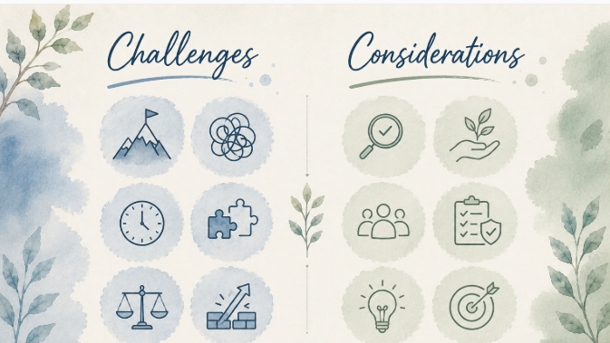

### Sections:

- [🏠 Home](index.html)
- [🏛️ Topic](topic.html)
- [⚒️ Semantic Methodology](methodology.html)
- [📈 SPARQL Queries & Data Results](sparql.html)
- [🧩 Gap Identification](gaps.html)
- [🤖 LLM Prompt: ChatGPT & Gemini](prompts.html)
- [🔗 RDF Triple Generation](rdf.html)
- [⚠️ Key Challenges](challenges.html)
- [🎯 Conclusions & Insights](conclusions.html)

<h1 style="color:#ff0000;">⚠️ Key Challenges</h1>

<h2 style="color:#ff0000;">CHALLENGES AND CONSIDERATIONS</h2>

## 📌 Major Challenges Faced During the Project

- **Identifying information gaps within the [ArCo](http://wit.istc.cnr.it/arco/) Knowledge Graph** proved considerably **more challenging than expected**. The main difficulty was not simply finding missing information, but first **understanding what information should reasonably be present** for a historical healthcare institution such as the [**Spedale del Ceppo**](https://w3id.org/arco/resource/Site/4215fe83165269413c37c21663c3d94b). Unlike many prominent cultural heritage entities, this historical building is represented through a relatively sparse network of predicates and a **limited knowledge graph**.
- When searching for the [**Spedale del Ceppo**](https://w3id.org/arco/resource/Site/4215fe83165269413c37c21663c3d94b) in [**ArCo**](http://wit.istc.cnr.it/arco/), the **results primarily referred to its artistic elements**, specifically the coat of arms (*stemmi*), rather than to the hospital itself. Consequently, a significant and complex part of the investigation consisted of **distinguishing between the main cultural site** (the hospital as the primary subject) and **the numerous connected artistic resources**.
- The exploration process was heavily constrained by the **limited number of available predicates and relationships, making it difficult to identify relevant information and connections**.
- To identify **hidden gaps**, it was necessary to **understand how similar historical hospitals were represented in [ArCo](http://wit.istc.cnr.it/arco/) and which properties were commonly used to describe them**. For this reason, we conducted a detailed comparative analysis involving other institutions, such as: the [**Ex Ospedale della SS.ma Trinità in Bologna**](https://w3id.org/arco/resource/ArchitecturalOrLandscapeHeritage/0800242653), the [**Ex Ospedale della Misericordia in Grosseto**](https://w3id.org/arco/resource/ArchitecturalOrLandscapeHeritage/0900352753A), and the [**Spedale degli Innocenti**](https://w3id.org/arco/resource/Site/db159e90f5ed83e3d851e7206ccbbd26) in Florence.

  This exploratory phase was essential to understand which types of information are typically associated with former hospitals in the knowledge graph and **to establish a baseline for evaluation**.

- Through this extensive exploration, we identified **four significant gaps**: two **related to the hospital** and two **related to the main coat of arms**.
- **Hospital Gaps:** The first concerned whether the hospital had undergone **restoration interventions**, while the second concerned its **current function**. Although the **Spedale del Ceppo** currently operates as a **museum**, this information was not explicitly represented in the knowledge graph.
- **Coat of Arms Gaps:** Through comparison with the Spedale degli Innocenti, we observed that emblem-related information was commonly available in [ArCo](http://wit.istc.cnr.it/arco/) , yet our target emblem lacked details regarding its **physical shape and its commissioner**.

## 📌 Challenges in Semantic Interpretation and Query Construction

- **Semantic Ambiguity of Predicates:** Another major difficulty concerned the semantic interpretation of [ArCo](http://wit.istc.cnr.it/arco/) predicates, where **identifying the correct missing information** required a detailed examination of **apparently similar properties**. A significant example emerged when building queries for the commissioning information of the coat of arms. The ontology includes both the predicates [**a-cd:hasCommission**](https://w3id.org/arco/ontology/context-description/hasCommission 
) and [**a-cd:hasCommittent**](https://w3id.org/arco/ontology/context-description/hasCommittent), which initially appeared to express the same concept, so **we had to ask [Gemini](https://gemini.google.com/app) for a clarification**. This analysis revealed a crucial ontological distinction: hasCommission refers to the commissioning event itself, whereas hasCommittent identifies the specific individual or institution responsible for commissioning the cultural property. **Understanding this difference** was vital because our objective was not to represent the existence of a commission event, but rather to identify and link the actual agent responsible, namely [**Leonardo Buonafede**](https://w3id.org/arco/resource/Agent/3b24b91d3ef48d6e11dbc72e4b6939e8).
- Beyond the semantic challenges, we also had to deal with **technical problems related to the functioning of the [ArCo](http://wit.istc.cnr.it/arco/) server/database**, which resulted in server downtime and delayed our project advancement for several days.

## 📌 Interaction and Evaluation of Artificial Intelligence Systems

- The **complexity of the ontology directly affected our interaction with Large Language Models**. When **prompts** were formulated in a **generic** way, the generated analyses tended to **remain superficial, incomplete, and often overlooked relevant semantic distinctions**.
- To obtain reliable results and reduce ambiguities when investigating historical relationships, selecting appropriate predicates, or constructing SPARQL queries, **it was frequently necessary to explicitly encourage step-by-step reasoning**. In this context, the **Chain-of-Thought** prompting technique proved especially useful for forcing deeper semantic analysis.
- We encountered several difficulties when using AI systems to generate valid **SPARQL CONSTRUCT** queries to add the missing information. To validate the outputs, we compared the performance of different models:
- [**ChatGPT**](https://chatgpt.com/) demonstrated a **stronger capacity for in-depth analysis** and was ultimately more effective in producing correct, logically sound, and executable SPARQL CONSTRUCT queries.
- [**Gemini**](https://gemini.google.com/app) often **required additional modifications, multi-turn refinements**, and corrections **before generating a working query**, even when provided with the exact same prompt instructions.
