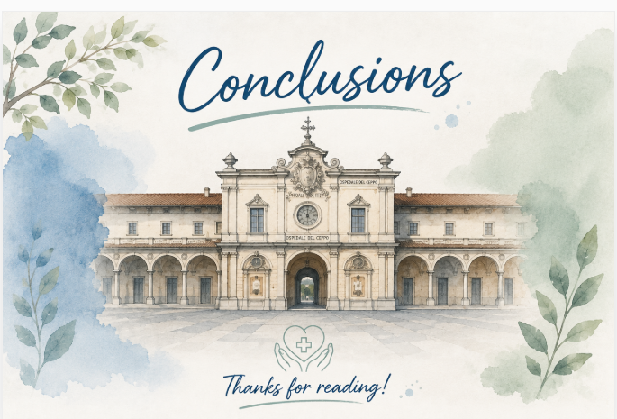

### Sections:

- [🏠 Home](index.html)
- [🏛️ Topic](topic.html)
- [⚒️ Semantic Methodology](methodology.html)
- [📈 SPARQL Queries & Data Results](sparql.html)
- [🧩 Gap Identification](gaps.html)
- [🤖 LLM Prompt: ChatGPT & Gemini](prompts.html)
- [🔗 RDF Triple Generation](rdf.html)
- [⚠️ Key Challenges](challenges.html)
- [🎯 Conclusions & Insights](conclusions.html)

<h1 style="color:#ff0000;">🎯 Conclusions & Insights</h1>

<h2 style="color:#ff0000;">CONCLUSIONS</h2>

Our project on the [**Spedale del Ceppo**](https://w3id.org/arco/resource/Site/4215fe83165269413c37c21663c3d94b) provided an opportunity to investigate how **semantic web technologies** and **large language models** can support the documentation and exploration of Italian cultural heritage. The project highlighted both the advantages and challenges of these digital tools.

## ⚙️ Using SPARQL and the ArCo Ontology

Working with SPARQL and the [ArCo](http://wit.istc.cnr.it/arco/) ontology demonstrated the value of structured knowledge representation for cultural heritage data. In particular, we discovered that:

- **Choosing appropriate keywords** and concepts is essential for retrieving meaningful and relevant information.
- SPARQL enables highly targeted searches, making it possible to **identify relationships between entities as well as gaps** or inconsistencies within the available data.
- The ontology-based approach facilitates a **deeper understanding of how cultural heritage assets are described and interconnected.**

## 🤖 Insights from Large Language Models

By experimenting with [**ChatGPT**](https://chatgpt.com/) and [**Gemini**](https://gemini.google.com/app), we were able to assess **how different LLMs perform** when applied to cultural heritage research tasks:

- Both models benefited from carefully designed prompts that included examples, clear instructions, and structured input.
- [**ChatGPT**](https://chatgpt.com/) generally produced responses that were **coherent** and **well-organized**, even if in some cases it was quite **schematic**.
- [**Gemini**](https://gemini.google.com/app) gave us **accurate** and **satisfying answers**; we were able to observe that [Gemini](https://gemini.google.com/app) often achieved **stronger results when supplied with detailed few-shot prompts**, demonstrating that prompt design can significantly influence model performance.

## 💡Potential Future Enhancements

The project also revealed several opportunities for enriching the semantic representation of the [Ospedale del Ceppo](https://w3id.org/arco/resource/Site/4215fe83165269413c37c21663c3d94b):

- The **knowledge graph could be expanded** with information about restoration and **conservation interventions**, currently not represented in the dataset.
- Additional data concerning the **current use** of the site could be included to better describe its transformation from a historical hospital into a museum and cultural heritage site.
- **The coat of arms associated with the Ospedale del Ceppo** could be enriched with further metadata, such as its **shape** and **commissioner**, providing a more complete artistic and historical description.
- Stronger **semantic links** could be established **between the Spedale del Ceppo, the Museo dello Spedale del Ceppo**, related artworks, and historical figures.
- Further connections to archival sources and other cultural heritage resources could contribute to a more comprehensive and interconnected digital representation of the site.

Overall, this project allowed us to develop practical skills in semantic data modelling, SPARQL querying, and prompt engineering, while helping to enhance the digital visibility of one of Tuscany's most important historical and cultural landmarks.
