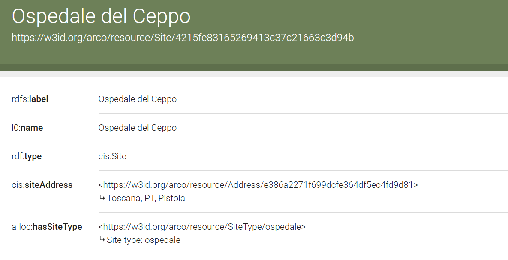
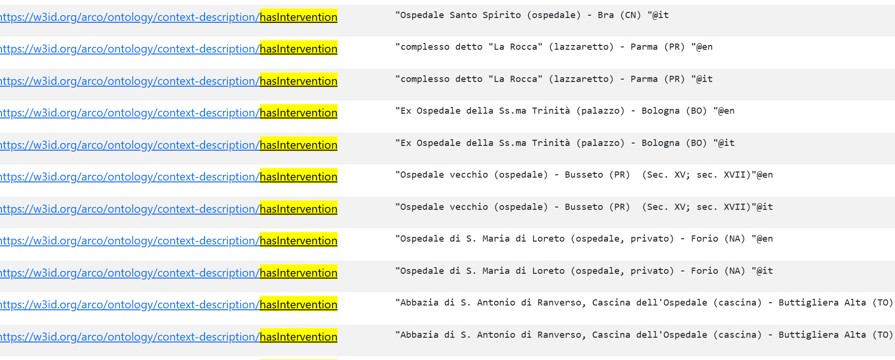
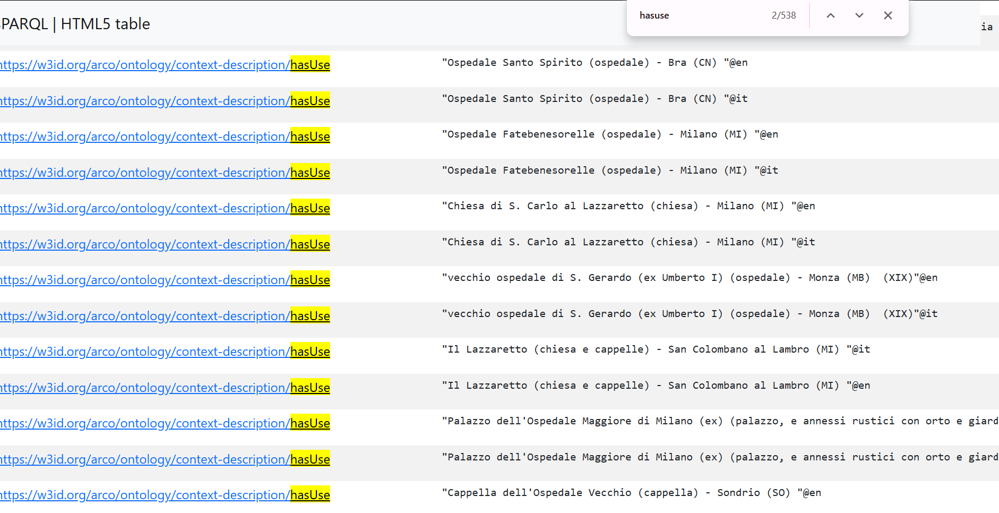
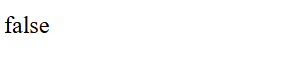
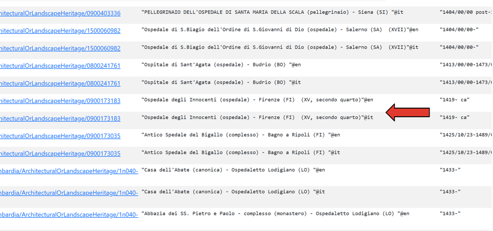
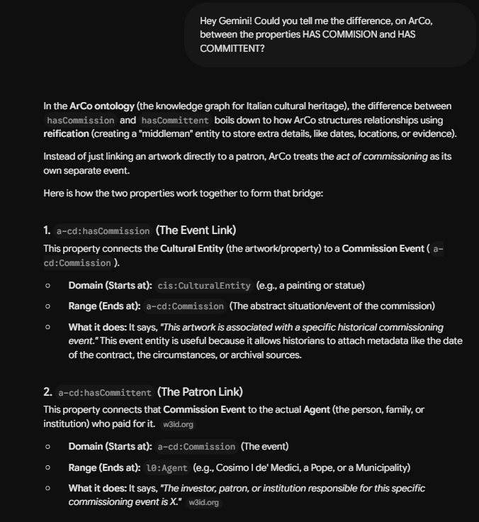
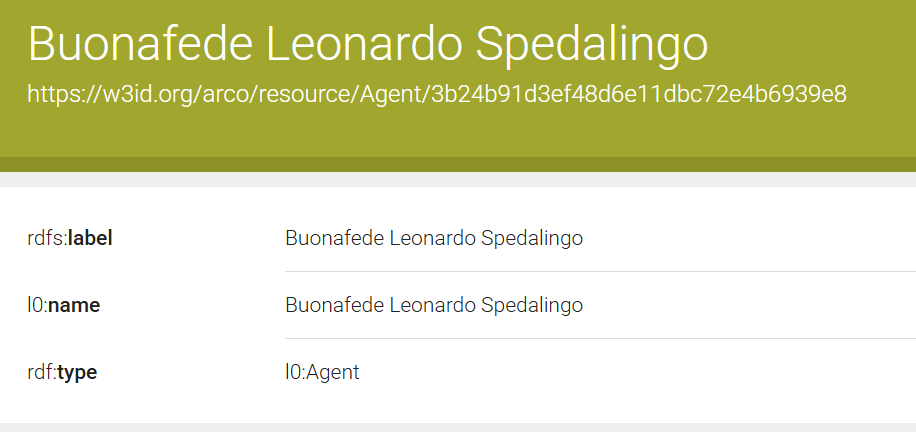
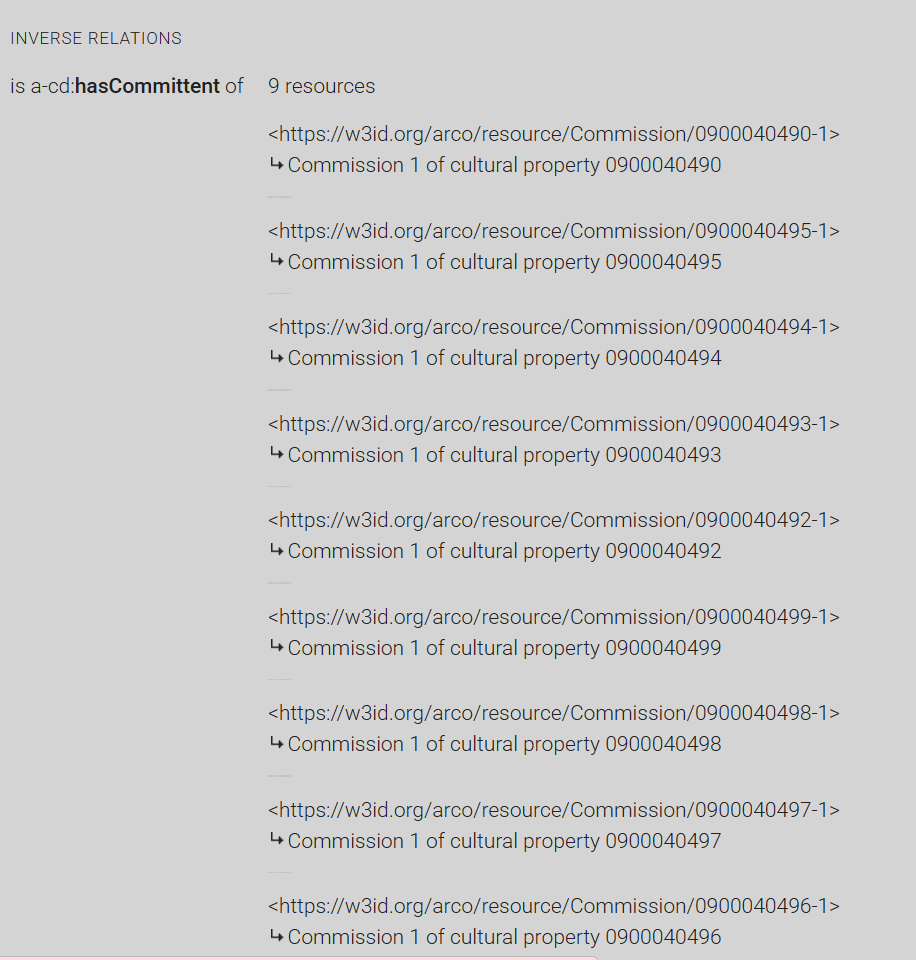
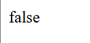

### Sections:

- [🏠 Home](index.html)
- [🏛️ Topic](topic.html)
- [⚒️ Semantic Methodology](methodology.html)
- [📈 SPARQL Queries & Data Results](sparql.html)
- [🧩 Gap Identification](gaps.html)
- [🤖 LLM Prompt: ChatGPT & Gemini](prompts.html)
- [🔗 RDF Triple Generation](rdf.html)
- [⚠️ Key Challenges](challenges.html)
- [🎯 Conclusions & Insights](conclusions.html)

<h1 style="color:#ff0000;">🧩 Gap Identification</h1>

<h2 style="color:#ff0000;">HOW WE IDENTIFIED THE INFORMATION GAPS</h2>

<h2 style="color:#ff0000;">IDENTIFICATION OF GAP 1 AND GAP 2</h2>

Following the retrieval of the IRI for the [**Ospedale del Ceppo**](https://w3id.org/arco/resource/Site/4215fe83165269413c37c21663c3d94b) in Query 1, a direct inspection of the entity's page in the Knowledge Graph revealed a significant sparsity of data. While the entity exists, it lacks many of the standard descriptive properties (predicates) that would typically document a cultural heritage site of its importance.



To systematically identify what specific information was missing (the "gaps"), we needed to establish a baseline. We decided to investigate which properties are normally associated with similar historical healthcare structures within the **ArCo ontology** to enrich the information available about the **Spedale del Ceppo**.

To do this, we formulated **Query 7** to extract the predicates commonly linked to these types of buildings. We expanded our search terms to include "**ospedale**" and "**lazzaretto**", since it represents a synonymous of "ospedale" from a historical and functional point of view.

Since the Spedale del Ceppo is a historical institution dating back to the late medieval and early modern periods, the search was restricted to cultural heritage entities **whose dates fell between the XIV and XVII centuries**. The query retrieved the distinct properties used to describe architectural, landscape, historical, and artistic heritage entities matching these criteria.

<h2 style="color:#ff0000;">SPARQL QUERY 7:</h2>

```sparql
PREFIX rdf: <http://www.w3.org/1999/02/22-rdf-syntax-ns#>
PREFIX arco: <https://w3id.org/arco/ontology/arco/>
PREFIX a-cd: <https://w3id.org/arco/ontology/context-description/>

SELECT DISTINCT ?property ?label
WHERE {
  {
    ?cp a arco:ArchitecturalOrLandscapeHeritage ;
        rdfs:label ?label ;
        dc:date ?date ;
        ?property ?value

    FILTER(REGEX(?label, "ospedale|lazzaretto", "i"))

  } UNION {

    ?cp a arco:HistoricOrArtisticProperty ;
        rdfs:label ?label ;
        dc:date ?date ;
        ?property ?value

    FILTER(REGEX(?label, "ospedale|lazzaretto", "i"))
    FILTER(REGEX(STR(?date), "^(13|14|15|16)\\d{2}"))
  }
}
ORDER BY ASC(?property)
```

<h2 style="color:#ff0000;">Explanation of the Query:</h2>

We started with a broad exploratory approach. Our first goal was to extract a comprehensive list of all predicates (?property) currently used in the Knowledge Graph to describe any hospital or lazaretto. To ensure we didn't miss anything, we used a **UNION** clause to search across both structural sites (arco:ArchitecturalOrLandscapeHeritage) and historic/artistic classifications (arco:HistoricOrArtisticProperty).

For each entity (?cp), the query extracts its label (rdfs:label), date (dc:date), and all associated properties through the generic pattern ?property ?value. A regular expression filter is then applied to the label in order to select only entities whose names contain the terms "ospedale" or "lazzaretto", regardless of capitalization.

In the second branch of the query, which targets HistoricOrArtisticProperty entities, an additional filter is applied to the date field. The expression `FILTER(REGEX(STR(?date), "^(13|14|15|16)\d{2}"))` restricts the results to entities dated between the fourteenth and seventeenth centuries (1300–1699), a period particularly relevant for the historical development of institutions such as the Ospedale del Ceppo.

The **DISTINCT** keyword ensures that duplicate property–label combinations are removed from the result set, while the clause **ORDER BY ASC(?property)** sorts the output alphabetically according to the property URI. This facilitates the identification and comparison of the properties most frequently used to describe historical hospitals and lazarettos within the ArCo ontology.

The execution of this query returned a massive, comprehensive list of properties attached to various hospitals. This gave us a great overview of the ontology's vocabulary.

The resulting list of properties was subsequently analyzed to select the most informative ones. We therefore chose to focus the next phase of our research on two highly relevant properties: **has intervention** ([https://w3id.org/arco/ontology/context-description/hasIntervention](https://w3id.org/arco/ontology/context-description/hasIntervention)) (to track architectural modifications over time) and **has use** ([https://w3id.org/arco/ontology/context-description/hasUse](https://w3id.org/arco/ontology/context-description/hasUse)) (to document its historical functions).





<h2 style="color:#ff0000;">Demonstrating the Gaps via ASK Queries</h2>

To definitively prove the **lack of information regarding interventions and historical uses** for the Ospedale del Ceppo, we used the SPARQL **ASK** query form. Unlike **SELECT** queries that return data tables, an ASK query returns a simple **Boolean response** (true or false) indicating whether a specific pattern exists in the Knowledge Graph.

We formulated two distinct ASK queries (**Query 8 and 9**) targeting the **a-cd:hasIntervention** and **a-cd:hasUse** predicates, respectively. By binding these properties to the Ospedale del Ceppo entity within the WHERE clause, we asked the endpoint if any such relationships existed. In both cases, the endpoint returned **false**. This Boolean response provides undeniable evidence that the specific metadata regarding the architectural modifications and historical functions of the hospital are currently missing from the ArCo dataset, **confirming our gap analysis.**

<h2 style="color:#ff0000;">SPARQL Query 8:</h2>

```sparql
PREFIX rdf: <http://www.w3.org/1999/02/22-rdf-syntax-ns#>
PREFIX rdfs: <http://www.w3.org/2000/01/rdf-schema#>
PREFIX arco: <https://w3id.org/arco/ontology/arco/>
PREFIX a-cd: <https://w3id.org/arco/ontology/context-description/>
PREFIX cis: <https://w3id.org/arco/ontology/cis/>

ASK WHERE {
  {
    ?cp a arco:ArchitecturalOrLandscapeHeritage ;
        rdfs:label ?l .
  }
  UNION
  {
    ?cp a cis:Site ;
        rdfs:label ?l .
  }
  FILTER(REGEX(?l, "Ospedale del Ceppo", "i"))
  FILTER(REGEX(?l, "Pistoia", "i"))

  ?cp a-cd:hasIntervention ?intervention .
}
```

<h2 style="color:#ff0000;">Result:</h2>



<h2 style="color:#ff0000;">SPARQL Query 9:</h2>

```sparql
PREFIX rdf: <http://www.w3.org/1999/02/22-rdf-syntax-ns#>
PREFIX rdfs: <http://www.w3.org/2000/01/rdf-schema#>
PREFIX arco: <https://w3id.org/arco/ontology/arco/>
PREFIX a-cd: <https://w3id.org/arco/ontology/context-description/>
PREFIX cis: <https://w3id.org/arco/ontology/cis/>

ASK WHERE {
  {
    ?cp a arco:ArchitecturalOrLandscapeHeritage ;
        rdfs:label ?l .
  }
  UNION
  {
    ?cp a cis:Site ;
        rdfs:label ?l .
  }
  FILTER(REGEX(?l, "Ospedale del Ceppo", "i"))
  FILTER(REGEX(?l, "Pistoia", "i"))

  ?cp a-cd:hasUse ?use .
}
```

<h2 style="color:#ff0000;">Result:</h2>


<h2 style="color:#ff0000;">IDENTIFICATION OF GAP 3 AND GAP 4</h2>

To further investigate potential metadata gaps (**Gap 3** and **Gap 4**), we returned to the extensive list of historical healthcare facilities generated by **Query 7**.



We sought a highly comparable, yet perhaps more universally recognized institution, to serve as a benchmark. Within the results, we identified the **Spedale degli Innocenti** ([https://w3id.org/arco/resource/Site/db159e90f5ed83e3d851e7206ccbbd26](https://w3id.org/arco/resource/Site/db159e90f5ed83e3d851e7206ccbbd26)) in Florence, exploring its main entity page in the Knowledge Graph.

A striking similarity between the **Ospedale del Ceppo** and the **Spedale degli Innocenti** is that both historic buildings are architecturally renowned for their exterior loggias, which are richly decorated with famous coats of arms (*stemmi*), glazed terracotta roundels often associated to the Della Robbia or Benedetto Buglioni.

Given this shared artistic feature, we wanted to verify how the *stemmi* of a well-documented institution like the Spedale degli Innocenti were described in ArCo. Our goal was to first **retrieve the IRI of its coat of arms** to **use it** as a point of **comparison** against the **coats of arms we had already found for the Ospedale del Ceppo** in order to **investigate similarities and differences** in their descriptions.

<h2 style="color:#ff0000;">Query 10 - Retrieving the Coat of Arms of Spedale degli Innocenti's IRI</h2>

In this query, we are searching the ArCo Knowledge Graph to retrieve the specific IRIs and names (labels) of the coats of arms (stemmi) belonging to the Spedale degli Innocenti.

- **SELECT DISTINCT:** Defines which variables (?cp for the IRI, and ?label for the name) we want to output in our results table. The **DISTINCT** keyword ensures that any duplicate entries are removed from the final list.
- **WHERE:** The core block of the query. It contains the specific patterns and conditions the data must match to be extracted.
- **a:** A standard SPARQL shortcut for "is a type of" (formally rdf:type). It specifies that the entity (?cp) must be classified specifically as an arco:HistoricOrArtisticProperty (an artwork).
- **FILTER:** Restricts the search results, keeping only the items that meet the exact rules we set.
- **REGEX:** Performs an advanced text search inside the ?label strings.
- **"stemma", "i"**: We force the system to only pick artworks that are explicitly called a "stemma". The "i" tells it to ignore capitals.
- **"(O|S)pedale degli Innocenti"**: This is our smartest rule. Because this hospital is very old, some archivists cataloged it using the ancient spelling "Spedale", while others used the modern "Opedale". By writing (O|S), we tell the machine to automatically find both versions, ensuring we don't miss any coats of arms just because of a spelling difference.

<h2 style="color:#ff0000;">SPARQL Query 10:</h2>

```sparql
PREFIX rdf: <http://www.w3.org/1999/02/22-rdf-syntax-ns#>
PREFIX rdfs: <http://www.w3.org/2000/01/rdf-schema#>
PREFIX arco: <https://w3id.org/arco/ontology/arco/>

SELECT DISTINCT ?cp ?label
WHERE {
  ?cp a arco:HistoricOrArtisticProperty ;
      rdfs:label ?label .

  FILTER(REGEX(?label, "stemma", "i"))
  FILTER(REGEX(?label, "(O|S)pedale degli Innocenti", "i"))
}
```

<h2 style="color:#ff0000;">Results:</h2>

The query was successful and provided the specific IRI(s) representing the **coats of arms of the Spedale degli Innocenti**. By obtaining this data, we were able to establish a direct comparison between the IRI profile of the Spedale degli Innocenti's *stemma* and that of the Ospedale del Ceppo.

The comparison revealed that the coat of arms of the Spedale del Ceppo was already described with a relatively rich set of information. However, by examining the corresponding resource for the coat of arms of the Spedale degli Innocenti, we identified two potentially enrichable aspects in the description of the Spedale del Ceppo's coat of arms: its **shape** and its **commissioning information**, officially defining **Gap 3 and Gap 4**.

<h2 style="color:#ff0000;">More in detail:</h2>

- stemma gentilizio dell'Ospedale degli Innocenti (rilievo) by Della Robbia Andrea (attribuito) (sec. XV) — [https://w3id.org/arco/resource/HistoricOrArtisticProperty/0900284362](https://w3id.org/arco/resource/HistoricOrArtisticProperty/0900284362)
- stemma dell'Ospedale del Ceppo e della città di Pistoia (rilievo) by Buglioni Benedetto (sec. XVI) — [https://w3id.org/arco/resource/HistoricOrArtisticProperty/0900040491](https://w3id.org/arco/resource/HistoricOrArtisticProperty/0900040491)

<h2 style="color:#ff0000;">GAP 3:</h2>

Regarding the first aspect, the comparison suggested the possibility of adding information related to the shape through the **hasShape** ([https://w3id.org/arco/ontology/denotative-description/hasShape](https://w3id.org/arco/ontology/denotative-description/hasShape)) property. This would provide a more detailed description of the physical characteristics of the coat of arms.

<h2 style="color:#ff0000;">GAP 4:</h2>

A clear-up is needed concerning the second aspect we want to focus on. From the details of the Stemma of the Ospedale degli Innocenti, we found these predicates:

- **a-cd:hasCommittent** ([https://w3id.org/arco/ontology/context-description/hasCommittent](https://w3id.org/arco/ontology/context-description/hasCommittent))
- **a-cd:hasCommission** ([https://w3id.org/arco/ontology/context-description/hasCommission](https://w3id.org/arco/ontology/context-description/hasCommission))

This prompted a question about the **difference between** them, so we asked [**Gemini**](https://gemini.google.com/app) to clarify this distinction:



The answer indicated that **a-cd:hasCommittent** is the most appropriate predicate for our case, as it specifically identifies the **person** or entity that **commissioned** the **cultural property**.

We chose to focus on the **hasCommittent** property because the results of **Query 1** revealed that several coats of arms associated with the Spedale del Ceppo are linked to a specific agent, namely **Buonafede Leonardo Spedalingo** ([https://w3id.org/arco/resource/Agent/3b24b91d3ef48d6e11dbc72e4b6939e8](https://w3id.org/arco/resource/Agent/3b24b91d3ef48d6e11dbc72e4b6939e8)).

By examining the cultural heritage assets connected to this agent, we observed that the specific coat of arms under investigation:

"stemma dell'Ospedale del Ceppo e della città di Pistoia (rilievo) by Buglioni Benedetto (sec. XVI) — [https://w3id.org/arco/resource/HistoricOrArtisticProperty/0900040491](https://w3id.org/arco/resource/HistoricOrArtisticProperty/0900040491)"

**is not included among the resources currently associated with Spedalingo Leonardo Buonafede in the knowledge graph.**





This observation suggests **the presence of a potential gap**. Since other coats of arms belonging to the same historical and architectural context are already connected to Leonardo Buonafede through the **hasCommittent** relationship, it is reasonable to associate the "Stemma dell'Ospedale del Ceppo e della città di Pistoia (rilievo) by Buglioni Benedetto (sec. XVI)" — IRI: [https://w3id.org/arco/resource/HistoricOrArtisticProperty/0900040491](https://w3id.org/arco/resource/HistoricOrArtisticProperty/0900040491) — with the **same agent**.

**All in all**, based on this comparison, we concluded that the description of the coat of arms associated with the Spedale del Ceppo could be enriched by incorporating additional information concerning its **shape** and the **corresponding commissioner**.

<h2 style="color:#ff0000;">Demonstrating Gaps 3 and 4 via ASK Queries</h2>

To formally verify the missing data (**Gaps 3** and **4**) regarding the coats of arms of the Ospedale del Ceppo, we again employed the SPARQL **ASK** query form. This approach allows us to ask the Knowledge Graph a direct yes-or-no question about the existence of specific metadata linked to these artworks.

We formulated two distinct ASK queries (**Query 11** and **12**) targeting the **a-cd:hasShape** (physical form/shape) and **a-cd:hasCommittent** (information regarding the patron or commission) predicates.

We directed these queries specifically at the **arco:HistoricOrArtisticProperty** class, filtering for the labels "stemma", "Ospedale del Ceppo", and "Pistoia". In both instances, the endpoint returned a **false** Boolean response. This definitive outcome proves that the information about the physical shape and original commissioning is currently entirely absent from their records.

<h2 style="color:#ff0000;">SPARQL Query 11:</h2>

This query asks if there is an artwork labeled as a *stemma* of the Ospedale del Ceppo in Pistoia that has an associated shape property ([a-cd:hasShape](https://w3id.org/arco/ontology/denotative-description/hasShape)).

```sparql
PREFIX rdf: <http://www.w3.org/1999/02/22-rdf-syntax-ns#>
PREFIX rdfs: <http://www.w3.org/2000/01/rdf-schema#>
PREFIX arco: <https://w3id.org/arco/ontology/arco/>
PREFIX a-cd: <https://w3id.org/arco/ontology/context-description/>

ASK WHERE {
  ?cp a arco:HistoricOrArtisticProperty ;
      rdfs:label ?label .

  FILTER(REGEX(?label, "stemma", "i"))
  FILTER(REGEX(?label, "Ospedale del Ceppo", "i"))
  FILTER(REGEX(?label, "Pistoia", "i"))

  ?cp a-cd:hasShape ?shape .
}
```

<h2 style="color:#ff0000;">Result:</h2>



<h2 style="color:#ff0000;">SPARQL Query 12:</h2>

This query asks if the same artwork has any recorded information regarding its commissioner or patron ([a-cd:hasCommittent](https://w3id.org/arco/ontology/context-description/hasCommittent)).

```sparql
PREFIX rdf: <http://www.w3.org/1999/02/22-rdf-syntax-ns#>
PREFIX rdfs: <http://www.w3.org/2000/01/rdf-schema#>
PREFIX arco: <https://w3id.org/arco/ontology/arco/>
PREFIX a-cd: <https://w3id.org/arco/ontology/context-description/>

ASK WHERE {
  ?cp a arco:HistoricOrArtisticProperty ;
      rdfs:label ?label .

  FILTER(REGEX(?label, "stemma", "i"))
  FILTER(REGEX(?label, "Ospedale del Ceppo", "i"))
  FILTER(REGEX(?label, "Pistoia", "i"))

  ?cp a-cd:hasCommittent ?committent .
}
```

<h2 style="color:#ff0000;">Result:</h2>


