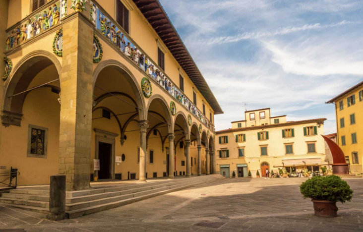

# SPEDALE DEL CEPPO

## A masterpiece of the medieval architecture

### Sections:

- [🏠 Home](index.html)
- [🏛️ Topic](topic.html)
- [⚒️ Semantic Methodology](methodology.html)
- [📈 SPARQL Queries & Data Results](sparql.html)
- [🧩 Gap Identification](gaps.html)
- [🤖 LLM Prompt: ChatGPT & Gemini](prompts.html)
- [🔗 RDF Triple Generation](rdf.html)
- [⚠️ Key Challenges](challenges.html)
- [🎯 Conclusions & Insights](conclusions.html)

<h2 style="color:#ff0000;">INTRODUCTION</h2>

The project was carried out within the framework of the Knowledge Engineering for the Humanities course at the [University of Bologna](https://www.unibo.it/en). The objective was to combine **SPARQL queries** and **Large Language Models (LLMs)** to enrich an existing cultural heritage knowledge graph with new information. By integrating structured knowledge extraction with AI-generated insights, the project explores the potential of these technologies to enhance the representation and accessibility of cultural heritage data.

We chose the [**Spedale del Ceppo**](https://en.wikipedia.org/wiki/Ospedale_del_Ceppo) in [Pistoia](https://en.wikipedia.org/wiki/Pistoia) as our topic, one of the most significant hospital complexes in [Tuscany](https://en.wikipedia.org/wiki/Tuscany). The building, a historic 13th-century hospital, represents an important example of architectural, artistic, and social heritage, reflecting centuries of healthcare practices and urban development. The Spedale del Ceppo is a cornerstone of Pistoia's civic identity. Having served as the city's primary hospital for over seven centuries, it represents the historical heart of local social welfare and remains a focal point of the urban landscape. Today, the former hospital operates as a museum and serves as the gateway to the city's underground archaeological pathways (*[Pistoia Sotterranea](https://www.pistoiasotterranea.it/)*).

Its rich historical background, as well as the presence of notable artistic elements, makes it a particularly interesting case of study for cultural heritage research.

Furthermore, the limited representation of the Spedale del Ceppo within existing knowledge graphs provided an opportunity to investigate how semantic technologies and Large Language Models can contribute to the enrichment of cultural heritage data.

We used [ArCo](http://wit.istc.cnr.it/arco), the official ontology network and RDF dataset of the Italian Ministry of Culture, as our foundational knowledge graph. ArCo delivers a comprehensive representation of Italy's cultural heritage and features a robust SPARQL endpoint for deep semantic querying. Furthermore, its modular design and domain-specific ontologies perfectly align with our project goals, particularly regarding tangible cultural assets.

<h2 style="color:#ff0000;">TOOLS:</h2>

- [**ArCo**](http://wit.istc.cnr.it/arco/)
- [**ArCo SPARQL endpoint**](https://dati.cultura.gov.it/sparql)
- [**ChatGPT**](https://chatgpt.com/)
- [**Gemini**](https://gemini.google.com/app)

<h2 style="color:#ff0000;">LET'S MEET THE GROUP:</h2>

This project was collaboratively developed by:

|  |  |  |  |
|:---:|:---:|:---:|:---:|
| [**Alice Lorenzi**](https://github.com/alice-lorenzi) | [**Chiara Middei**](https://github.com/Chiaramiddei) | [**Camilla Vinotti**](https://github.com/camylla02) | [**Anna Laura Ricciardi**](https://github.com/annalauraricci) |
