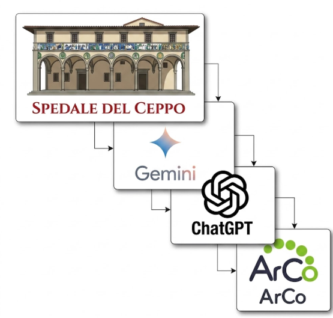

### Sections:

- [🏠 Home](index.html)
- [🏛️ Topic](topic.html)
- [⚒️ Semantic Methodology](methodology.html)
- [📈 SPARQL Queries & Data Results](sparql.html)
- [🧩 Gap Identification](gaps.html)
- [🤖 LLM Prompt: ChatGPT & Gemini](prompts.html)
- [🔗 RDF Triple Generation](rdf.html)
- [⚠️ Key Challenges](challenges.html)
- [🎯 Conclusions & Insights](conclusions.html)

<h1 style="color:#ff0000;">⚒️ Semantic Methodology</h1>

To explore and enrich the semantic representation of the [Spedale del Ceppo](https://w3id.org/arco/resource/Site/4215fe83165269413c37c21663c3d94b), our project employed a structured, multi-phase methodology leveraging the ArCo Knowledge Graph and Large Language Models (LLMs).

<h2 style="color:#ff0000;">STEP-BY-STEP WORKFLOW:</h2>

1. **Topic Selection:** We identified the [Spedale del Ceppo](https://w3id.org/arco/resource/Site/4215fe83165269413c37c21663c3d94b) as a culturally significant heritage site that would greatly benefit from enhanced digital visibility and semantic enrichment.
2. **Ontology Exploration:** We navigated the [ArCo](http://wit.istc.cnr.it/arco/) ontologies via its official SPARQL endpoint ([https://dati.cultura.gov.it/sparql](https://dati.cultura.gov.it/sparql)) to assess the baseline data currently available for the monument.
3. **Query Formulation:** We engineered a series of targeted SPARQL queries, using key domain terms to extract all pertinent information regarding the Spedale.
4. **Result Analysis:** We systematically reviewed the retrieved data to determine the scope of existing knowledge and pinpoint specific omissions.
5. **Gap Identification:** By evaluating the current semantic descriptions, we highlighted areas where the monument's historical, artistic, and architectural profile lacked depth.
6. **Prompt Engineering:** We designed structured prompts using three distinct strategies to elicit accurate, supplementary facts from LLMs ([Gemini](https://gemini.google.com/app?hl=it) and [ChatGPT](https://chatgpt.com/)).
7. **LLM Output Comparison:** We cross-referenced and evaluated the responses generated by both models to guarantee factual consistency and semantic richness.
8. **RDF Translation:** We converted the newly acquired insights into formal RDF triples, ensuring strict adherence to ArCo's established vocabularies and structural guidelines.
9. **Triple Modeling:** We refined the proposed RDF triples so that they seamlessly integrate with ArCo's underlying ontological framework.
10. **Website Development:** We built a dedicated project website hosted on GitHub Pages to showcase our methodology and findings in a clear, visually organized manner.
11. **Open Access Publication:** The completed site was deployed as an open educational resource, allowing researchers and the public to explore and repurpose our enriched dataset.
