### Sections:

- [🏠 Home](index.html)
- [🏛️ Topic](topic.html)
- [⚒️ Semantic Methodology](methodology.html)
- [📈 SPARQL Queries & Data Results](sparql.html)
- [🧩 Gap Identification](gaps.html)
- [🤖 LLM Prompt: ChatGPT & Gemini](prompts.html)
- [🔗 RDF Triple Generation](rdf.html)
- [⚠️ Key Challenges](challenges.html)
- [🎯 Conclusions & Insights](conclusions.html)

<h1 style="color:#ff0000;">🤖 LLM Prompt: ChatGPT & Gemini</h1>

<h2 style="color:#ff0000;">USE LLM TO VERIFY AND PRODUCE NEW KNOWLEDGE</h2>

We used **two LLMs**: [**ChatGPT**](https://chatgpt.com/) and [**Gemini**](https://gemini.google.com/app).

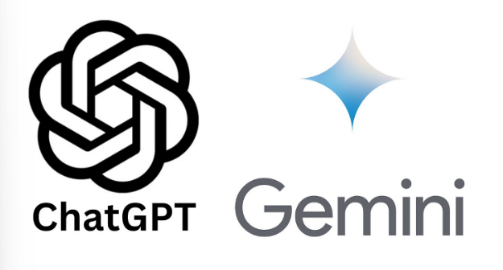

<h2 style="color:#ff0000;">✳️First Missing Information: Restoration Intervention</h2>

<h2 style="color:#ff0000;">✏️Few-shot Technique</h2>

This technique is **useful** when:

- A **zero-shot prompt** doesn't yield reliable results.
- The task requires a **specific format** or **nuanced understanding**.
- We want to **guide** the model with **concrete examples** to **produce richer** and **more relevant responses**.

The property [**a-cd:hasIntervention**](https://w3id.org/arco/ontology/context-description/hasIntervention) relates a **cultural entity** to an **intervention on it**, for conservational or other purposes. We employed this technique because we thought it would be useful to guide the model through **questions about restoration intervention on other subjects similar to the Spedale del Ceppo**. Therefore, we gave some specific examples.

<h2 style="color:#ff0000;">📸CHATGPT'S ANSWER:</h2>

Q: Has the **Ex Ospedale della Ss.ma Trinità in Bologna** undergone any restoration intervention?

A: Yes — *the Ex Ospedale della Santissima Trinità in Bologna has undergone restoration and adaptive-reuse interventions, but mostly **partial and planned rather than a single complete, documented "restoration campaign" of the whole complex***. […]

Q: Has the **Ex Ospedale della Misericordia in Grosseto** undergone any restoration intervention?

A: Yes — the Ex Ospedale della Misericordia in Grosseto has undergone restoration and renovation interventions. Historical and architectural sources indicate that: […]

Q: Has the **Spedale del Ceppo in Pistoia** undergone any restoration intervention?

A: Yes – the Spedale del Ceppo in Pistoia has undergone multiple restoration interventions, both historical and modern, and they are actually quite well documented. […]

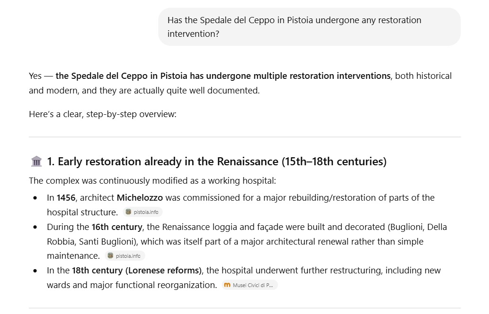

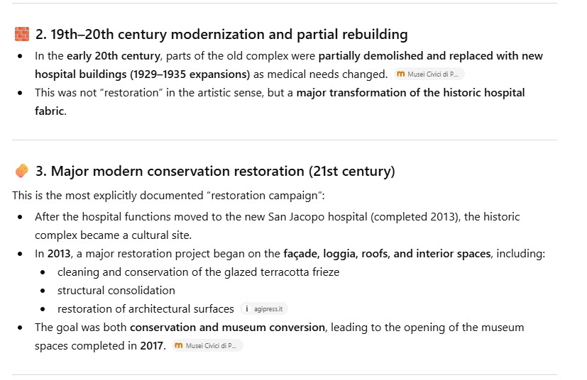

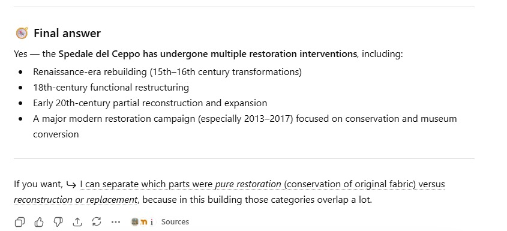

<h2 style="color:#ff0000;">📋Considerations:</h2>

- ChatGPT provided us with the information we were looking for. The **answer** was quite **schematic** but **satisfying**.
- The **information** was divided according to **different type of restoration intervention** and according to **different periods of time**, starting from the 15th century; in some cases, it also **specified the year of the restoration**.

<h2 style="color:#ff0000;">📸GEMINI'S ANSWER:</h2>

Q: Has the **Ex Ospedale della Ss.ma Trinità in Bologna** undergone any restoration intervention?

A: Yes, the *Ex Ospedale della Ss.ma Trinità* (also known historically as the Ospedale dei Convalescenti or the Oratorio della SS. Trinità), located on *Via Scipione Dolfi* in Bologna, has undergone a major and highly successful architectural restoration intervention […]

Q: Has the **Ex Ospedale della Misericordia in Grosseto** undergone any restoration intervention?

A: Yes, the Ex Ospedale della Misericordia in Grosseto has undergone several significant restoration and urban regeneration interventions since it ceased operations as the city's main hospital in 1974.

Located in the historic center between Piazza San Francesco, Via Ginori, and Via Saffi, the complex has been progressively repurposed and modernized, with major works accelerating recently thanks to European funding.

Here is a breakdown of the key interventions: […]

Q: Has the **Spedale del Ceppo in Pistoia** undergone any restoration intervention?

A: Yes, the *Spedale del Ceppo* in Pistoia has undergone substantial and highly visible restoration interventions. Much like its counterpart in Florence, because the hospital operated continuously for centuries before modern medical services were relocated to a new facility, it required major efforts to protect its Renaissance masterworks and revitalize the massive urban complex […]

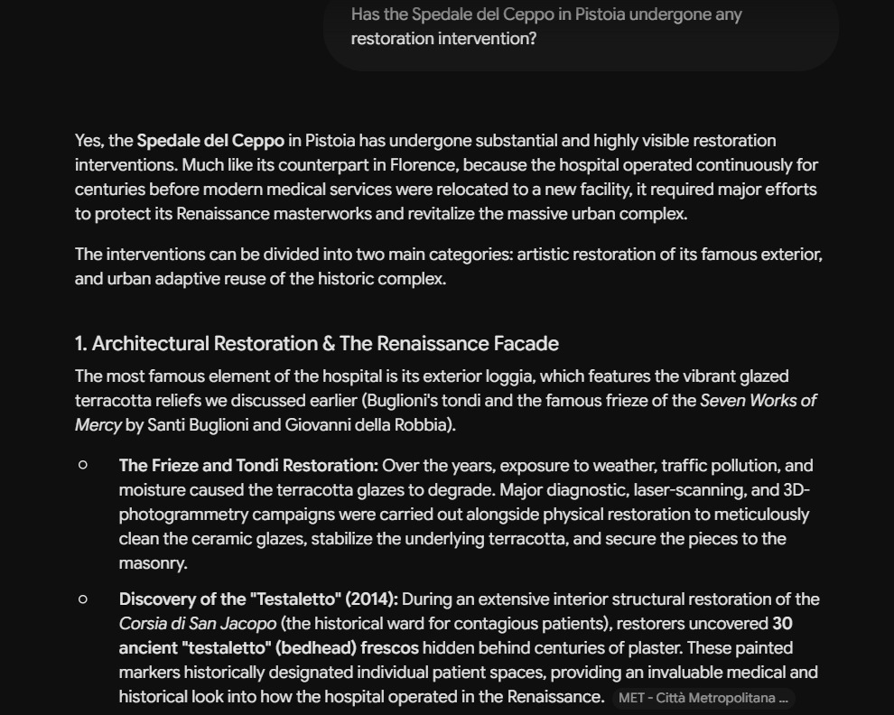

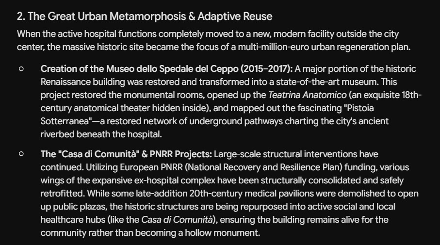

<h2 style="color:#ff0000;">📋Considerations:</h2>

- The **answer** was **detailed**: Gemini mentioned the **restoration intervention** dividing the whole process into **two main categories**.
- The first category concerns artistic restoration regarding the external facade, mentioning the Frieze and Tondi restoration deteriorated because of external factors, and the discovery of the "testaletto" frescos.
- The second category refers to its adaptive reuse, mentioning the creation of the Museum of the Spedale del Ceppo and the "Casa di Comunità".
- Unlike ChatGPT, Gemini placed **greater emphasis** on **explaining the restoration intervention rather than providing specific dates** related to the overall restoration process.

<h2 style="color:#ff0000;">Second Missing Information: Current Use</h2>

<h2 style="color:#ff0000;">Few-shot Technique</h2>

The property [**a-cd:hasUse**](https://w3id.org/arco/ontology/context-description/hasUse) relates a **cultural entity** to **its use**. In the ArCo ontology, this property can be associated with **both current and historical uses** of a cultural property. However, for the purpose of this task, **we focus exclusively on the current use**, and historical uses are intentionally not considered. Similarly to the First Missing Information case, we decided to use **the same technique giving examples of other hospitals** drawn from the list.

<h2 style="color:#ff0000;">📸CHATGPT'S ANSWER:</h2>

Q: What is the current use of **Ex Ospedale della SS.ma Trinità in Bologna**?

A: The Ex Ospedale della SS.ma Trinità in Bologna is not used as a functioning hospital anymore. Its current condition is essentially that of a historic building with private ownership and non-medical use, with no ongoing healthcare activity. More specifically […]

Q: What is the current use of the **Ex Ospedale della Misericordia in Grosseto**?

A: The Ex Ospedale della Misericordia in Grosseto is no longer used as a hospital. Its current function has been redefined following the relocation of healthcare activities to the modern Misericordia Hospital. Today, the historic complex is mainly used for educational and public purposes […]

Q: What is the current use of the **Spedale del Ceppo in Pistoia**?

A: Today the Spedale del Ceppo in Pistoia is no longer a functioning hospital. Its current use is primarily cultural and museum-based […]

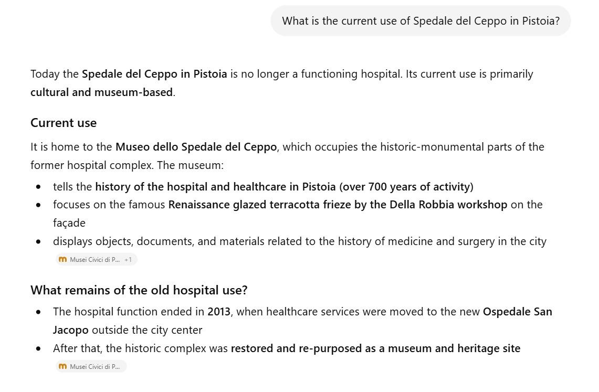

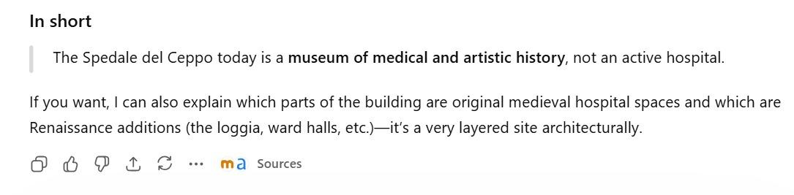

<h2 style="color:#ff0000;">📋Considerations:</h2>

- Following the example set through the Spedale Degli Innocenti and the Ex Ospedale della SS.ma Trinità, ChatGPT confirms that **Spedale del Ceppo** is **no longer a functioning hospital**, mentioning a **fundamental element**: **the museum**.
- It focuses on the **current use of the museum** which tells the story of the hospital and Pistoia's healthcare system and displays objects, documents and materials like the famous Renaissance frieze by the Della Robbia workshop.
- At the end it just specifies the fact that the **healthcare services** have been **moved** to the **new Ospedale San Jacopo**, also mentioning the restorations of the heritage site.
- So, ChatGPT briefly elucidates few information about the Spedale Del Ceppo through two bullet points lists, and **it lacks some piece of information** like the **Anatomical Theatre** and **Pistoia's Underground**.

<h2 style="color:#ff0000;">📸GEMINI'S ANSWER:</h2>

Q: What is the current use of the **Ex Ospedale della SS.ma Trinità in Bologna**?

A: The Ex Ospedale della SS.ma Trinità (specifically the complex that includes the former Convalescent Hospital and the adjacent Oratory of the Holy Trinity) located at Via Pompeo Scipione Dolfi 5–7 in Bologna, serves as a private corporate headquarters and cultural hub […]

Q: What is the current use of the **Ex Ospedale della Misericordia in Grosseto**?

A: The historic Ex Ospedale della Misericordia (located in the historic center of Grosseto between Via Ginori, Via Saffi, and Piazza San Francesco) stopped operating as the city's primary hospital in 1974 when healthcare services moved to a modern complex outside the city walls. The main historical complex has been repurposed as an educational and cultural hub, while sections of the surrounding old hospital grounds have undergone urban redevelopment […]

Q: What is the current use of the **Spedale del Ceppo in Pistoia**?

A: The Spedale del Ceppo (Hospital of the Stump) in Pistoia functioned continuously as a medical hospital from its founding in 1277 until 2013, when clinical operations were fully relocated to the modern San Jacopo Hospital outside the city walls.

Today, the monumental historic complex has been repurposed into a prominent cultural, historical, and scientific museum hub, managed by the civic museums of Pistoia […]

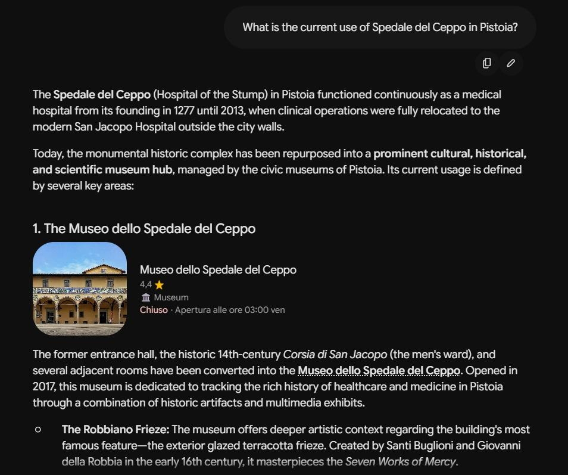

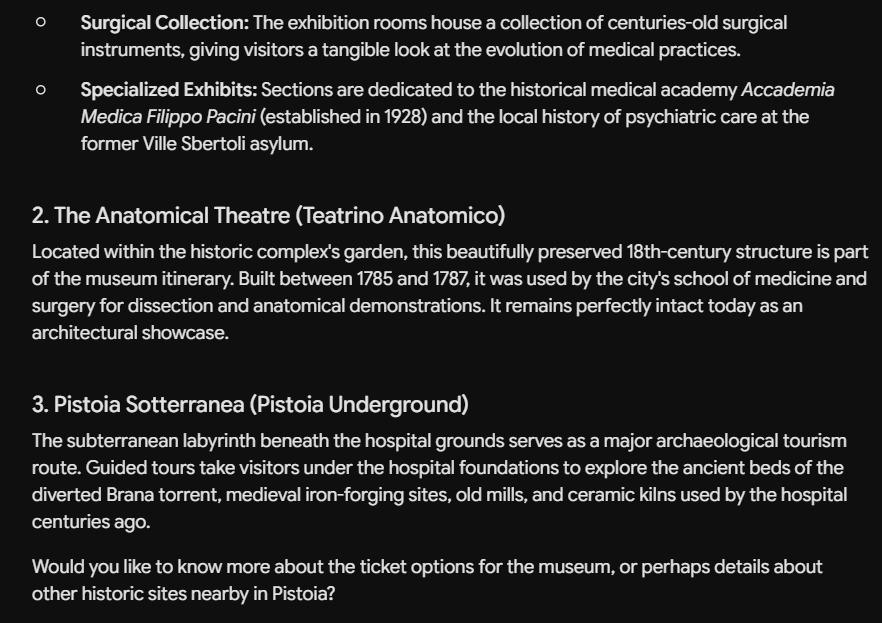

<h2 style="color:#ff0000;">📋Considerations:</h2>

- **Gemini** provides a **comprehensive** and **well-structured answer** regarding the current use of Spedale del Ceppo. We think that the response highlights effectively the **transition from a functional medical facility to the modern identity as a cultural and scientific hub**. The **language** used is **informative** and **more sophisticated** than the one used by Chat.
- **Gemini** and **ChatGPT both** mention the **presence of the Robbiano Frieze**, the building's most famous feature. Moreover, **Gemini mentions the Surgerical Collection** and the **Accademia Medica**.
- **Unlike ChatGPT**, **Gemini divides** and **explains** the **use of the Spedale del Ceppo** into **3 distinct entities**: the museum, the Anatomical Theatre and the Subterranean Tour, **providing a complete picture** of what the site offers today.
- It seemed to us that **Gemini**, **adding** the **place preview card** (from Google maps) and an **image of the subject**, makes the response **more visually engaging** and an **excellent resource** for someone planning a visit or researching the city's heritage.

<h2 style="color:#ff0000;">📋Further consideration of another possible gap:</h2>

The latest gap identification conducted on [ArCo](http://wit.istc.cnr.it/arco/) revealed an **additional significant lack of information**, concerning the **representation of the museum** associated with the architectural site of the hospital.

Specifically, we compared the **ArCo resource pages** (RDF entity pages) of the **Spedale degli Innocenti** in Florence with the one of the **Ospedale del Ceppo** in Pistoia.

This comparison highlights a significant difference in the semantic description of the two sites. While the **Spedale degli Innocenti** is **linked** to **additional entities** through the property [**cis:isSiteOf**](http://dati.beniculturali.it/cis/isSiteOf), the **Ospedale del Ceppo lacks such semantic relationship**.

In particular, **no cis:isSiteOf link** is **provided** to represent the **Museo dello Spedale del Ceppo**, despite the museum being the current function of the hospital.

Furthermore, **no RDF resource page** corresponding to the Museo dello Spedale del Ceppo is connected to the site. Consequently, the **current museum use** of the **Ospedale del Ceppo** is **not semantically represented in ArCo**.

As a result, the Ospedale del Ceppo is described only through basic information (name, address, and site type), with no semantic representation of its present-day museum function.

In ArCo, **"cis:isSiteOf"** links a **Cultural Institute or Site** **to an entity** (e.g., a **museum**, collection, service, or activity) that is located or hosted there.

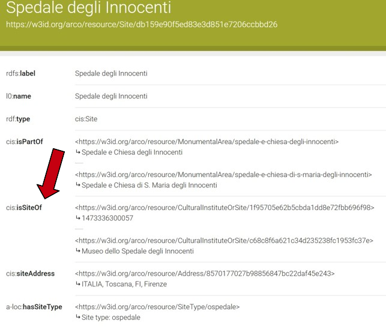

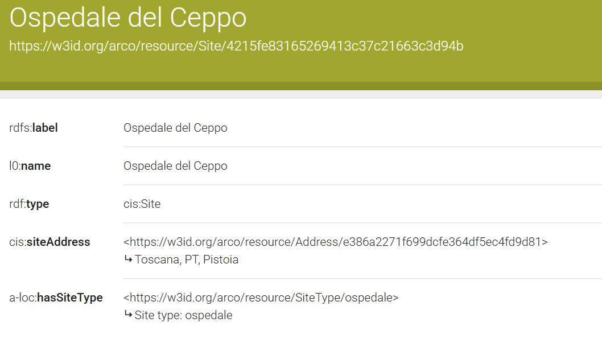

**Example of how it should be represented:**

```sparql
:SpedaleDelCeppo cis:isSiteOf :MuseoDelloSpedaleDelCeppo .
```

Meaning:

"The Spedale del Ceppo is the site of (hosts) the Museo dello Spedale del Ceppo."

<h2 style="color:#ff0000;">We ran QUERY 13 to make sure that the information about the Museo dell'Ospedale del Ceppo was missing:</h2>

```sparql
PREFIX rdfs: <http://www.w3.org/2000/01/rdf-schema#>
PREFIX arco: <https://w3id.org/arco/ontology/arco/>

ASK
WHERE {
  {
    ?cp a arco:ArchitecturalOrLandscapeHeritage ;
        rdfs:label ?label .
  } UNION {
    ?cp a arco:HistoricOrArtisticProperty ;
        rdfs:label ?label .
  }

  FILTER(REGEX(?label, "museo", "i"))
  FILTER(REGEX(?label, "Ceppo", "i"))
}
```

<h2 style="color:#ff0000;">Result:</h2>

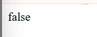

<h2 style="color:#ff0000;">Third Missing Information: Shape of the "Stemma dello Spedale del Ceppo"</h2>

<h2 style="color:#ff0000;">Zero-shot Prompting Technique</h2>

This technique is particularly **helpful** when:

- A **quick answer** is needed
- **No examples** are available
- The **task** is **generic** or **straightforward**

The property [**a-dd:hasShape**](https://w3id.org/arco/ontology/denotative-description/hasShape) is associated with the object's specific form. According to the Zero-shot Technique, we asked the LLMs a prompt **without giving any examples** or **demonstrations**, **relying on their general understanding of language and tasks**. This helps test their raw ability to provide **useful answers without prior context or scaffolding**. We also decided to add "by Buglioni" in our prompt, otherwise ChatGPT would have mixed up the stemmas.

<h2 style="color:#ff0000;">📸CHATGPT'S ANSWER:</h2>

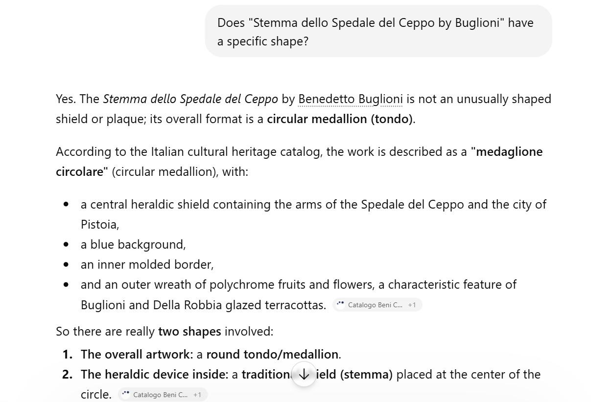

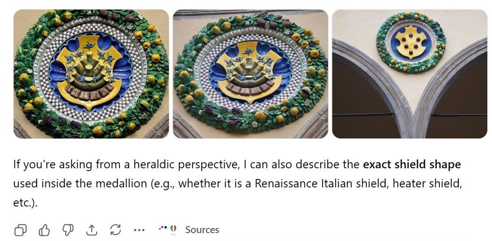

<h2 style="color:#ff0000;">📋Considerations:</h2>

- **ChatGPT** provided the information we were looking for, adding **more details** and **describing the Stemma of the Spedale internally** (shape, color, material).
- The **answer** was **detailed**: it distinguished between the **overall shape** and the **shape of the heraldic element within it**.
- **ChatGPT** also **included photos of the Stemma**.

<h2 style="color:#ff0000;">📸GEMINI'S ANSWER:</h2>

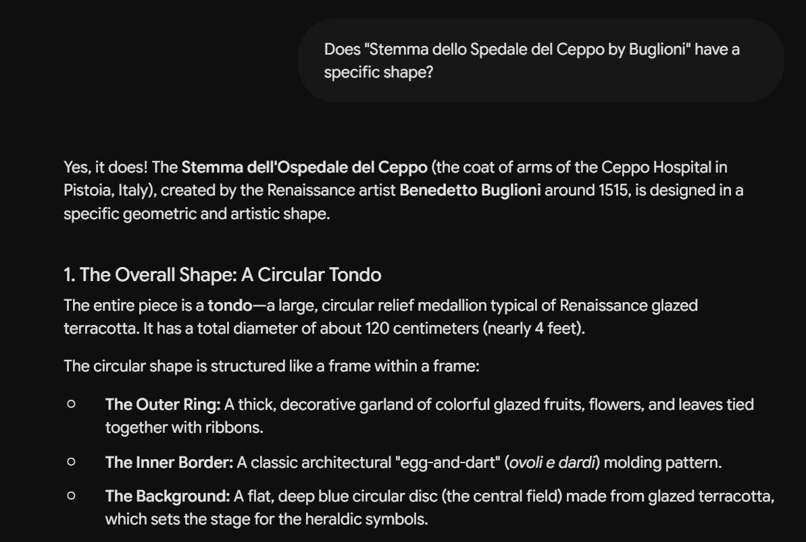

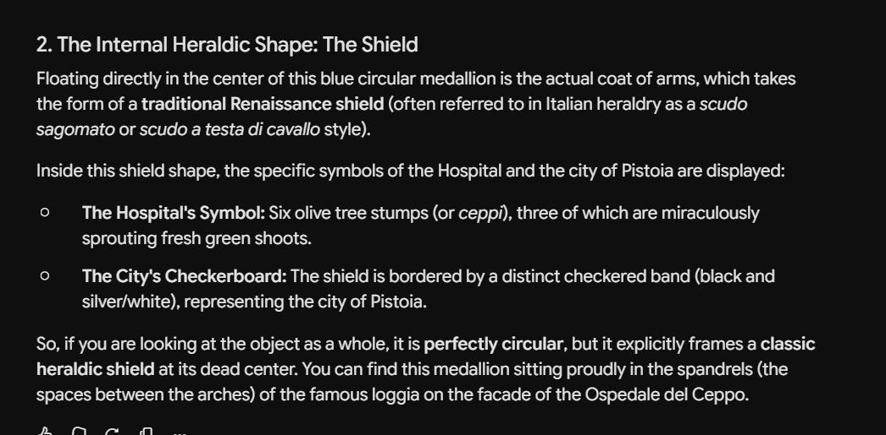

<h2 style="color:#ff0000;">📋Considerations:</h2>

- **Gemini** gave a **higher-quality**, **well-structured explanation** of the **subject** requested, providing the information we were looking for.
- The answer correctly identified the **artwork as a tondo** (circular relief) and **broke its composition into logical layers**. Moreover, Gemini provided the specific iconography, technical dimensions, and the style, **adding overall professional depth to the description**.
- Unlike ChatGPT, **Gemini did not include** a **photo** of the **Stemma**.

<h2 style="color:#ff0000;">🌐Confirmation from Official Source:</h2>

"Il tondo è circondato da un fregio ad ovoli ed è contornato da una ghirlanda di frutti e fiori policromi. Fa parte di una serie di cinque medaglioni e di quattro mezzi-medaglioni eseguiti per i pennacchi della loggia da Giovanni Della Robbia, come risulta dai documenti dell'Archivio dell'Ospedale del Ceppo, copiati dal Mather: da questi si apprende che nell'anno 1525 Giovanni riceveva la commissione della serie di medaglioni da parte dello spedalingo Messer Leonardo Buonafede, che aveva già impiegato lo scultore a Galatrona (1518) e altrove. La data 1525 compare inoltre nell'iscrizione di questo stesso medaglione. Questa serie di medaglioni - che fa parte dell'ultima attività di Giovanni - appare impostata su schemi consueti e svolta con accuratezza e precisione di mestiere. È certo presente un'ampia collaborazione di aiuti"

[https://catalogo.beniculturali.it/detail/HistoricOrArtisticProperty/0900040498](https://catalogo.beniculturali.it/detail/HistoricOrArtisticProperty/0900040498)

<h2 style="color:#ff0000;">Fourth Missing Information: Commissioner</h2>

<h2 style="color:#ff0000;">Chain-of-Thought (Zero-shot) Technique</h2>

This type of technique encourages the model to "think out loud" letting it **explain its reasoning step by step**, before giving a final answer. It helps the model reason through complex or multi-step problems, managing to **improve** the **quality of responses**, especially when dealing with complex or historical topics like **commissions** involving multiple figures.

In this case, we applied **Chain-of-Thought** prompting in combination with the **Zero-shot** approach because we wanted a **more detailed answer**.

<h2 style="color:#ff0000;">📸CHATGPT'S ANSWER:</h2>

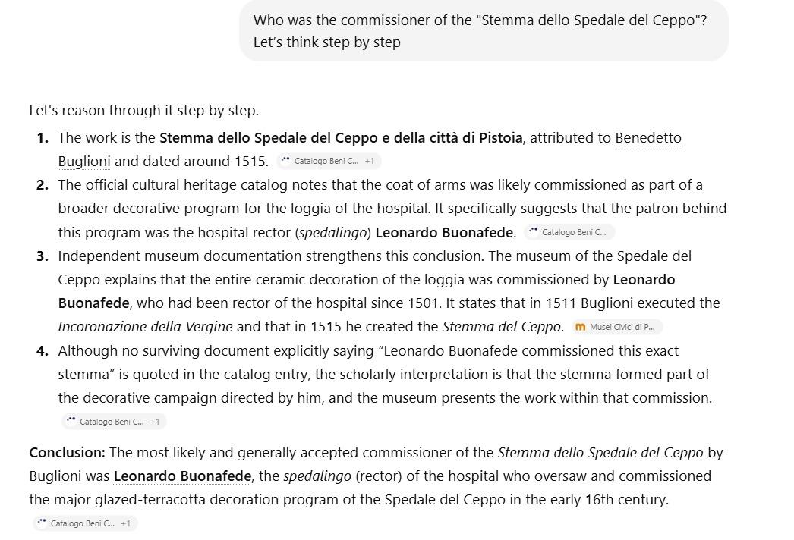

<h2 style="color:#ff0000;">📋Considerations:</h2>

- The answer was quite **detailed** given that **ChatGPT** provided information about the **commissioner, [Leonardo Buonafede](https://w3id.org/arco/resource/Agent/3b24b91d3ef48d6e11dbc72e4b6939e8)**, and **specified when** he was **appointed as hospital rector** with the objective of overseeing the artwork.
- It also mentioned the **museum documentation** which provides information on the commissioner and the artist, Benedetto Buglioni.
- **ChatGPT** identified **Buonafede** as the **most likely and generally accepted commissioner**, **deducing his role** in commissioning this specific Stemma.

<h2 style="color:#ff0000;">📸GEMINI'S ANSWER:</h2>

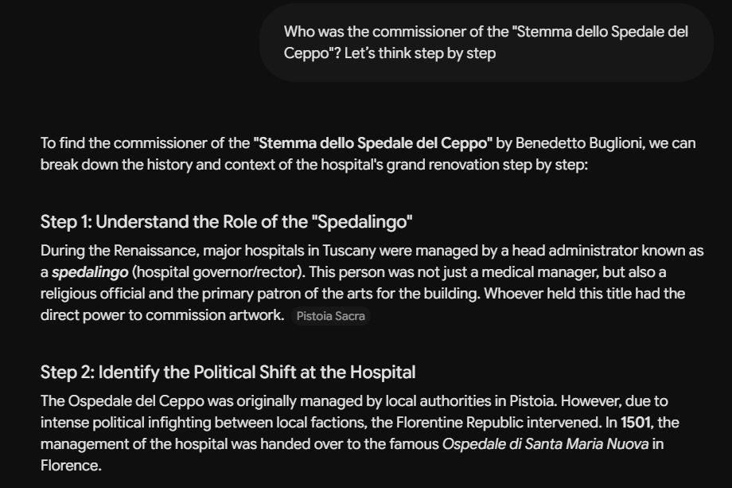

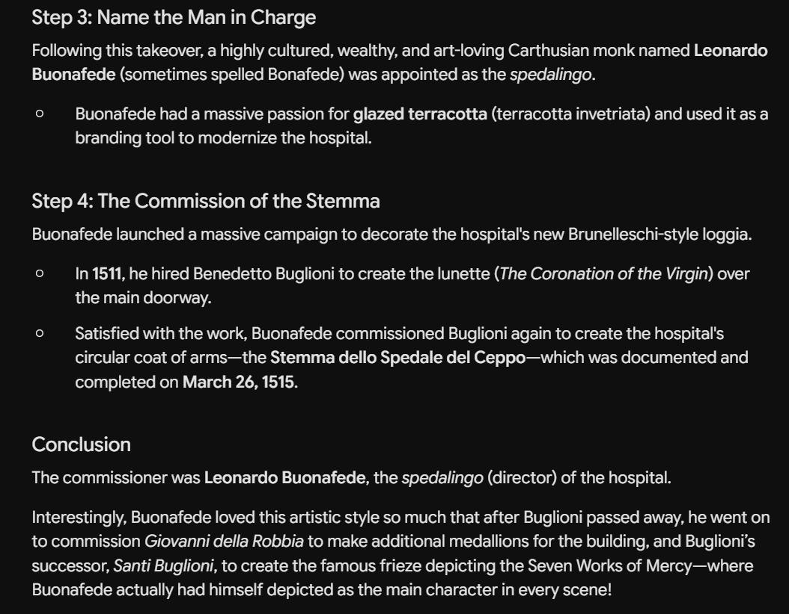

<h2 style="color:#ff0000;">📋Considerations:</h2>

- **Gemini** successfully identified the **commissioner** of the **Stemma**, through a detailed, **step-by-step** historical analysis making the political and historical information **easy to follow**.
- By defining in the first step the term **"Spedalingo"**, the response ensured the reader understood the **authority** behind the commission and it seemed **more precise** to us.
- **Gemini** accurately noted the shift management to the Florentine Ospedale di Santa Maria Nuova in 1501, which set the stage for Buonafede's leadership highlighting why he had the power to commission the work. **Gemini** was **more precise** than Chat GPT, mentioning the date of completion and the artistic medium.

<h2 style="color:#ff0000;">🌐Confirmation from Official Source:</h2>

"Fu dunque lo spedalingo fiorentino Leonardo Buonafede (in carica dal 1501 al 1532) a promuovere il completamento del loggiato, con la realizzazione dei rilievi in terracotta invetriata policroma (compreso il maestoso fregio con le *Sette Opere di Misericordia*), eseguiti dalle migliori maestranze fiorentine: i della Robbia e i Buglioni."

[https://musei.comune.pistoia.it/museo-spedale-ceppo-sede/](https://musei.comune.pistoia.it/museo-spedale-ceppo-sede/)

<h2 style="color:#ff0000;">📋General Considerations</h2>

- When dealing with straightforward questions **using the zero-shot technique** (such as the shape of the Stemma), both [**ChatGPT**](https://chatgpt.com/) and [**Gemini**](https://gemini.google.com/app) provide accurate and detailed answers. **Gemini** delivers a **highly structured, professional explanation**, while **ChatGPT** also answers well and uniquely includes photos in its response.
- For more complex questions guided by few-shot prompting (such as the current use of the site), **Gemini** proves to be exceptionally structured and clear, dividing its response into distinct entities and using more sophisticated language. **ChatGPT**, while schematic and providing the core information, tends to be briefer and misses some key details like the Anatomical Theatre.
- When **guided by the Chain-of-Thought technique** for historical reasoning (like identifying the commissioner), **both models provide detailed reasoning**. However, **Gemini** stands out by **providing a more precise, step-by-step historical analysis** that makes complex political contexts much easier to follow.
- Regarding **multimedia**, the inclusion of visual elements depends on the prompt rather than the model. **ChatGPT** included photos for the Stemma, whereas **Gemini** omitted them there but provided a visually engaging preview card and images for the heritage site's current use.
