### Sections:

- [🏠 Home](index.html)
- [🏛️ Topic](topic.html)
- [⚒️ Semantic Methodology](methodology.html)
- [📈 SPARQL Queries & Data Results](sparql.html)
- [🧩 Gap Identification](gaps.html)
- [🤖 LLM Prompt: ChatGPT & Gemini](prompts.html)
- [🔗 RDF Triple Generation](rdf.html)
- [⚠️ Key Challenges](challenges.html)
- [🎯 Conclusions & Insights](conclusions.html)

<h1 style="color:#ff0000;">🔗 RDF Triple Generation</h1>

<h2 style="color:#ff0000;">🏗️GENERATING OUR NEW TRIPLES</h2>

<h2 style="color:#ff0000;">✳️Triple of the First missing information</h2>

The resource describing the **Ospedale del Ceppo** does not contain any value for the property [**a-cd:hasIntervention**](https://w3id.org/arco/ontology/context-description/hasIntervention) while other architectural heritage resources in **ArCo** are linked to documented conservation interventions.

The Ospedale del Ceppo **has undergone restoration**, conservation and adaptive reuse interventions during its history. However, **these events are not represented in the RDF** description through the property **a-cd:hasIntervention**. This results in an instance-level completeness gap.

<h2 style="color:#ff0000;">✏️ Few-shot and chain of thought prompting techniques</h2>

We showed the following examples prompt:

**Example 1.**

**Subject**: Ex Ospedale della Ss.ma Trinità (palazzo) - Bologna (BO) — [https://w3id.org/arco/resource/ArchitecturalOrLandscapeHeritage/0800242653](https://w3id.org/arco/resource/ArchitecturalOrLandscapeHeritage/0800242653)

**Predicate**: [a-cd:hasIntervention](https://dati.cultura.gov.it/lodview-arco/ontology/context-description/hasIntervention)

**Object**: [https://w3id.org/arco/resource/ConservationIntervention/0800242653-conservation-intervention-1](https://w3id.org/arco/resource/ConservationIntervention/0800242653-conservation-intervention-1)

**Example 2:**

**Subject**: Ex Ospedale della Misericordia (palazzo, per uffici) - Grosseto (GR) — [https://w3id.org/arco/resource/ArchitecturalOrLandscapeHeritage/0900352753A](https://w3id.org/arco/resource/ArchitecturalOrLandscapeHeritage/0900352753A)

**Predicate**: [a-cd:hasIntervention](https://dati.cultura.gov.it/lodview-arco/ontology/context-description/hasIntervention)

**Object**: type of intervention 1 — [https://w3id.org/arco/resource/ConservationIntervention/0900352753A-conservation-intervention-1](https://w3id.org/arco/resource/ConservationIntervention/0900352753A-conservation-intervention-1) ; type of intervention 2 — [https://w3id.org/arco/resource/ConservationIntervention/0900352753A-conservation-intervention-2](https://w3id.org/arco/resource/ConservationIntervention/0900352753A-conservation-intervention-2)

**Example 3:**

**Subject**: Ex Ospedale del Crocifisso (ospedale) - Cesena (FC) — [https://w3id.org/arco/resource/ArchitecturalOrLandscapeHeritage/0800161844](https://w3id.org/arco/resource/ArchitecturalOrLandscapeHeritage/0800161844)

**Predicate**: [a-cd:hasIntervention](https://dati.cultura.gov.it/lodview-arco/ontology/context-description/hasIntervention)

**Object**: [https://w3id.org/arco/resource/ConservationIntervention/0800161844-conservation-intervention-1](https://w3id.org/arco/resource/ConservationIntervention/0800161844-conservation-intervention-1) Conservation intervention 1 on cultural property 0800161844; [https://w3id.org/arco/resource/ConservationIntervention/0800161844-conservation-intervention-2](https://w3id.org/arco/resource/ConservationIntervention/0800161844-conservation-intervention-2) Conservation intervention 2 on cultural property 0800161844

Please, could you transform the following information into RDF format and use ArCo ontology taking the previous triples as examples?

"The Ospedale del Ceppo has undergone some restoration interventions" Note that:

- IRI of Ospedale del Ceppo is [https://w3id.org/arco/resource/Site/4215fe83165269413c37c21663c3d94b](https://w3id.org/arco/resource/Site/4215fe83165269413c37c21663c3d94b)
- Predicate: [a-cd:hasIntervention](https://dati.cultura.gov.it/lodview-arco/ontology/context-description/hasIntervention) (from ArCo ontologies)
- Intervention IRIs do not exist in the current ArCo dataset, so **new IRIs need to be proposed**. Information about interventions should be retrieved from reliable external sources. The generated intervention resources should include available information such as intervention type, date, responsible actor, and description.

Also, please build the corresponding SPARQL CONSTRUCT query.

Let's think step by step.

<h2 style="color:#ff0000;">📸 CHATGPT'S ANSWER:</h2>

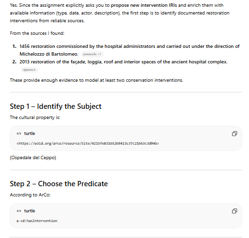

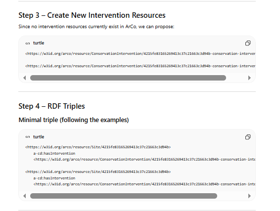

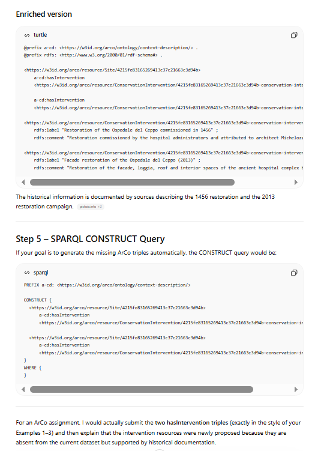

<h2 style="color:#ff0000;">📋 COPY OF THE RDF TRIPLE BY CHATGPT:</h2>

```sparql
<https://w3id.org/arco/resource/Site/4215fe83165269413c37c21663c3d94b>
    a-cd:hasIntervention
<https://w3id.org/arco/resource/ConservationIntervention/4215fe83165269413c37c21663c3d94b-conservation-intervention-1>

<https://w3id.org/arco/resource/Site/4215fe83165269413c37c21663c3d94b>
    a-cd:hasIntervention
<https://w3id.org/arco/resource/ConservationIntervention/4215fe83165269413c37c21663c3d94b-conservation-intervention-2>
```

<h2 style="color:#ff0000;">⚙️ SPARQL CONSTRUCT QUERY BY CHATGPT:</h2>

```sparql
PREFIX a-cd: <https://w3id.org/arco/ontology/context-description/>

CONSTRUCT {
  <https://w3id.org/arco/resource/Site/4215fe83165269413c37c21663c3d94b>
      a-cd:hasIntervention     <https://w3id.org/arco/resource/ConservationIntervention/4215fe83165269413c37c21663c3d94b-conservation-intervention-1> .
  <https://w3id.org/arco/resource/Site/4215fe83165269413c37c21663c3d94b>
      a-cd:hasIntervention
      <https://w3id.org/arco/resource/ConservationIntervention/4215fe83165269413c37c21663c3d94b-conservation-intervention-2> .
}
WHERE {
}
```

<h2 style="color:#ff0000;">📸 RESULT OBTAINED EXECUTING THE QUERY ON SPARQL BY CHATGPT:</h2>

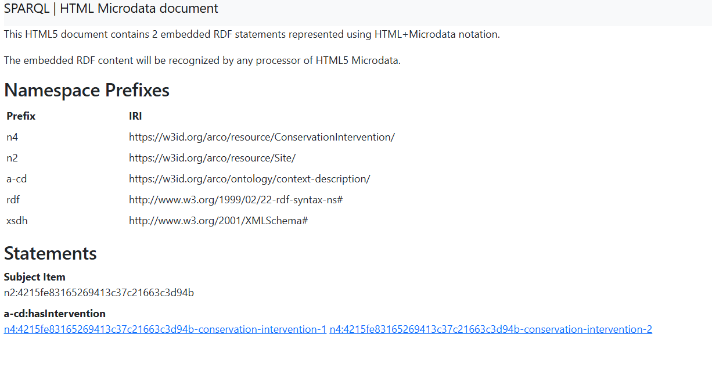

<h2 style="color:#ff0000;">📸 GEMINI'S ANSWER:</h2>

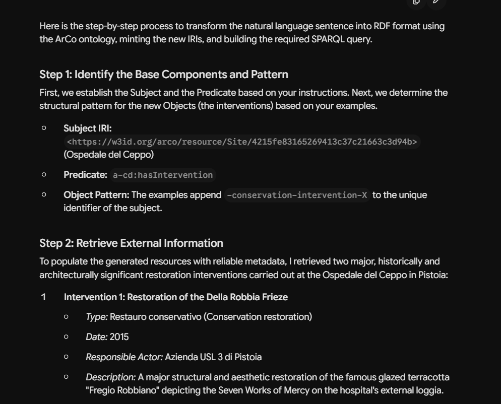

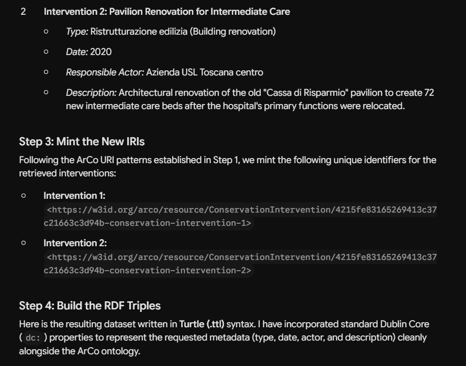

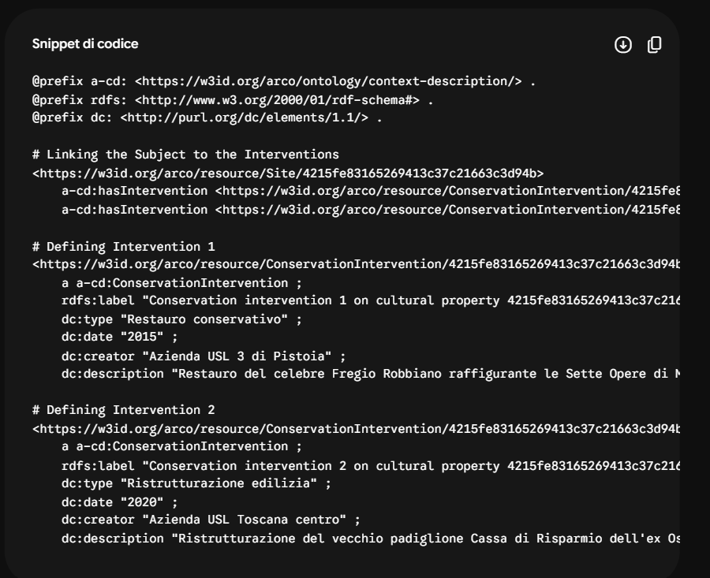

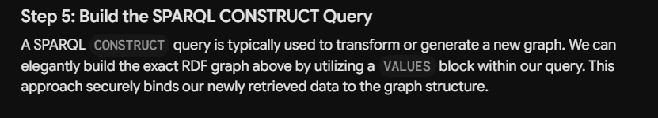

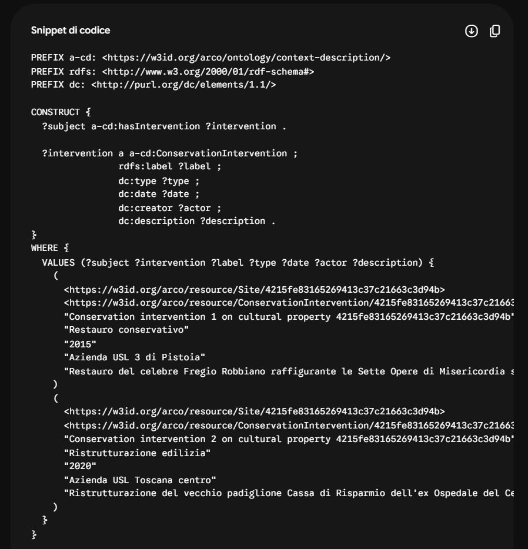

<h2 style="color:#ff0000;">📋 COPY OF THE RDF TRIPLE BY GEMINI:</h2>

```sparql
@prefix a-cd: <https://w3id.org/arco/ontology/context-description/> .
@prefix rdfs: <http://www.w3.org/2000/01/rdf-schema#> .
@prefix dc: <http://purl.org/dc/elements/1.1/> .

# Linking the Subject to the Interventions
<https://w3id.org/arco/resource/Site/4215fe83165269413c37c21663c3d94b>
    a-cd:hasIntervention <https://w3id.org/arco/resource/ConservationIntervention/4215fe83165269413c37c21663c3d94b-conservation-intervention-1> ;
    a-cd:hasIntervention <https://w3id.org/arco/resource/ConservationIntervention/4215fe83165269413c37c21663c3d94b-conservation-intervention-2> .

# Defining Intervention 1
<https://w3id.org/arco/resource/ConservationIntervention/4215fe83165269413c37c21663c3d94b-conservation-intervention-1>
    a a-cd:ConservationIntervention ;
    rdfs:label "Conservation intervention 1 on cultural property 4215fe83165269413c37c21663c3d94b" ;
    dc:type "Restauro conservativo" ;
    dc:date "2015" ;
    dc:creator "Azienda USL 3 di Pistoia" ;
    dc:description "Restauro del celebre Fregio Robbiano raffigurante le Sette Opere di Misericordia sul loggiato esterno dell'Ospedale del Ceppo." .

# Defining Intervention 2
<https://w3id.org/arco/resource/ConservationIntervention/4215fe83165269413c37c21663c3d94b-conservation-intervention-2>
    a a-cd:ConservationIntervention ;
    rdfs:label "Conservation intervention 2 on cultural property 4215fe83165269413c37c21663c3d94b" ;
    dc:type "Ristrutturazione edilizia" ;
    dc:date "2020" ;
    dc:creator "Azienda USL Toscana centro" ;
    dc:description "Ristrutturazione del vecchio padiglione Cassa di Risparmio dell'ex Ospedale del Ceppo per l'attivazione di 72 posti letto per cure intermedie." .
```

<h2 style="color:#ff0000;">⚙️ SPARQL CONSTRUCT QUERY BY GEMINI:</h2>

```sparql
PREFIX a-cd: <https://w3id.org/arco/ontology/context-description/>
PREFIX rdfs: <http://www.w3.org/2000/01/rdf-schema#>
PREFIX dc: <http://purl.org/dc/elements/1.1/>

CONSTRUCT {
  ?subject a-cd:hasIntervention ?intervention .
  ?intervention a a-cd:ConservationIntervention ;
                rdfs:label ?label ;
                dc:type ?type ;
                dc:date ?date ;
                dc:creator ?actor ;
                dc:description ?description .
}
WHERE {
  VALUES (?subject ?intervention ?label ?type ?date ?actor ?description) {
    (
      <https://w3id.org/arco/resource/Site/4215fe83165269413c37c21663c3d94b>
      <https://w3id.org/arco/resource/ConservationIntervention/4215fe83165269413c37c21663c3d94b-conservation-intervention-1>
      "Conservation intervention 1 on cultural property 4215fe83165269413c37c21663c3d94b"
      "Restauro conservativo"
      "2015"
      "Azienda USL 3 di Pistoia"
      "Restauro del celebre Fregio Robbiano raffigurante le Sette Opere di Misericordia sul loggiato esterno dell'Ospedale del Ceppo."
    )
    (
      <https://w3id.org/arco/resource/Site/4215fe83165269413c37c21663c3d94b>
      <https://w3id.org/arco/resource/ConservationIntervention/4215fe83165269413c37c21663c3d94b-conservation-intervention-2>
      "Conservation intervention 2 on cultural property 4215fe83165269413c37c21663c3d94b"
      "Ristrutturazione edilizia"
      "2020"
      "Azienda USL Toscana centro"
      "Ristrutturazione del vecchio padiglione Cassa di Risparmio dell'ex Ospedale del Ceppo per l'attivazione di 72 posti letto per cure intermedie."
    )
  }
}
```

<h2 style="color:#ff0000;">📸 RESULT OBTAINED EXECUTING THE QUERY ON SPARQL BY GEMINI:</h2>

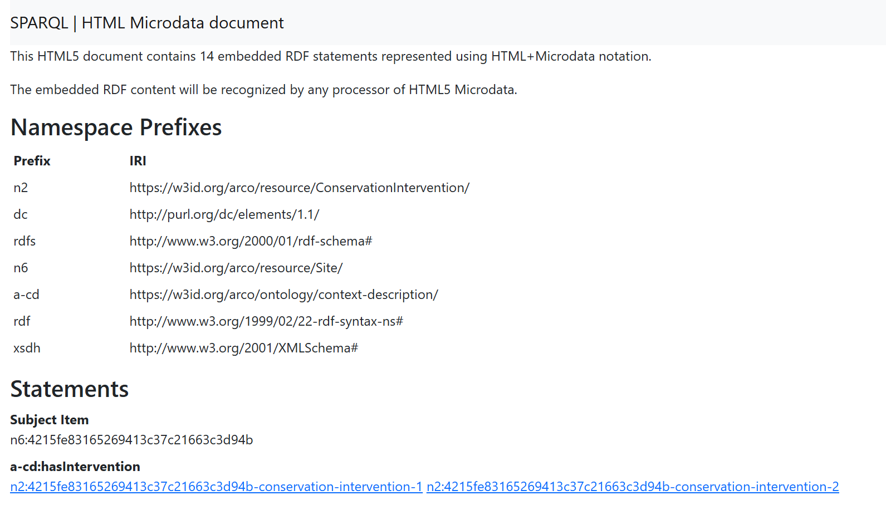

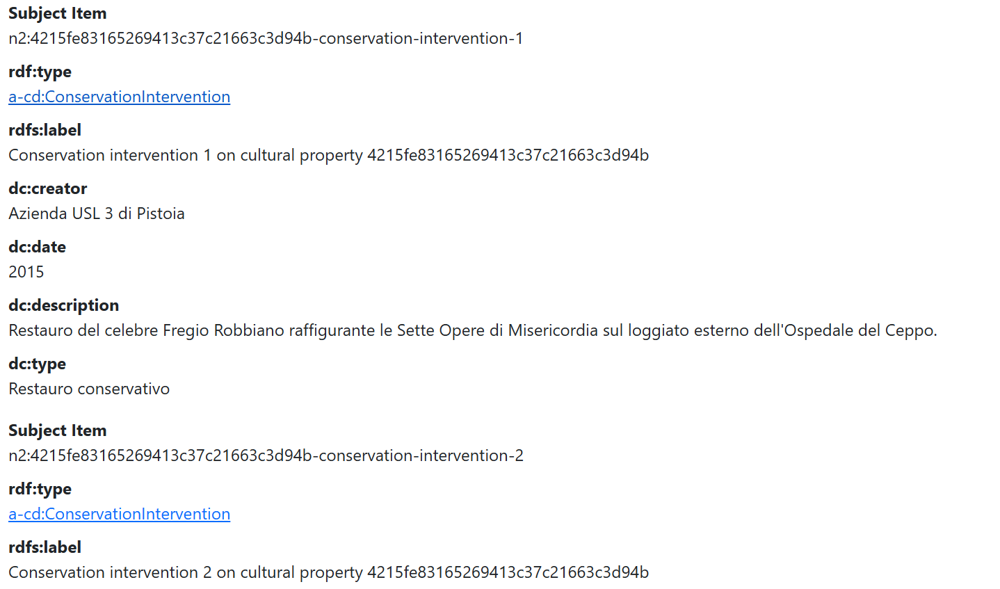

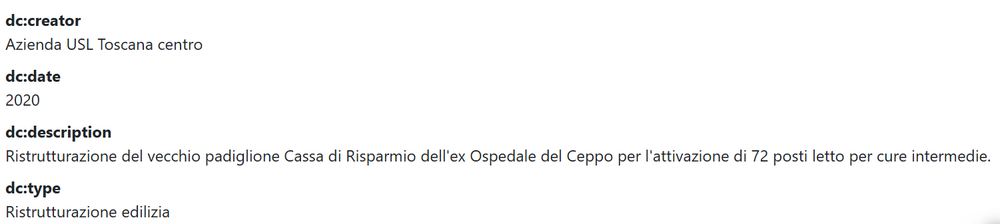

<h2 style="color:#ff0000;">Triple of the Second missing information</h2>

During the analysis of the ArCo dataset, we observed that the resource describing the Ospedale del Ceppo does not contain any value for the property [**a-cd:hasUse**](https://w3id.org/arco/ontology/context-description/hasUse). This represents an instance-level completeness gap, as the property is not instantiated for the resource despite being relevant for describing the functional history of a cultural property.

The property **a-cd:hasUse** is used in the ArCo ontology to represent the different functions or uses of a cultural property over time. It allows describing how a site or monument has been used, both in its current state and across different historical phases, thus supporting the reconstruction of its functional evolution.

In particular, **a-cd:hasUse** may refer to both **historical uses** and **current uses** of a cultural property. However, for the purpose of this task, **we focus exclusively on the current use**, while historical uses are intentionally excluded from the scope of this enrichment.

This choice allows us to maintain a consistent and well-defined modelling perspective, focusing on the present function of the [**Ospedale del Ceppo**](https://w3id.org/arco/resource/Site/4215fe83165269413c37c21663c3d94b) while leaving the reconstruction of past uses to future extensions of the dataset.

<h2 style="color:#ff0000;">✏️ Few-shot and chain of thought prompting techniques</h2>

Prompt:

**Example 1.**

**Subject**: Ex Ospedale della Ss.ma Trinità (palazzo) - Bologna (BO) — [https://w3id.org/arco/resource/ArchitecturalOrLandscapeHeritage/0800242653](https://w3id.org/arco/resource/ArchitecturalOrLandscapeHeritage/0800242653)

**Predicate**: [a-cd:hasUse](https://dati.cultura.gov.it/lodview-arco/ontology/context-description/hasUse)

**Object**: [https://w3id.org/arco/resource/Use/0800242653-current-use-1](https://w3id.org/arco/resource/Use/0800242653-current-use-1) [Current use 1 of cultural property 0800242653](https://dati.cultura.gov.it/lodview-arco/resource/Use/0800242653-current-use-1)

**Example 2:**

**Subject**: Ex Ospedale della Misericordia (palazzo, per uffici) - Grosseto (GR) — [https://w3id.org/arco/resource/ArchitecturalOrLandscapeHeritage/0900352753A](https://w3id.org/arco/resource/ArchitecturalOrLandscapeHeritage/0900352753A)

**Predicate**: [a-cd:hasUse](https://dati.cultura.gov.it/lodview-arco/ontology/context-description/hasUse)

**Object**: [https://w3id.org/arco/resource/Use/0900352753A-current-use-1](https://w3id.org/arco/resource/Use/0900352753A-current-use-1) [Current use 1 of cultural property 0900352753A](https://dati.cultura.gov.it/lodview-arco/resource/Use/0900352753A-current-use-1)

**Example 3:**

**Subject**: Ex Ospedale del Crocifisso (ospedale) - Cesena (FC) — [https://w3id.org/arco/resource/ArchitecturalOrLandscapeHeritage/0800161844](https://w3id.org/arco/resource/ArchitecturalOrLandscapeHeritage/0800161844)

**Predicate**: [a-cd:hasUse](https://dati.cultura.gov.it/lodview-arco/ontology/context-description/hasUse)

**Object**: [https://w3id.org/arco/resource/ConservationIntervention/0800161844-conservation-intervention-1](https://w3id.org/arco/resource/ConservationIntervention/0800161844-conservation-intervention-1) Conservation intervention 1 on cultural property 0800161844 [https://w3id.org/arco/resource/ConservationIntervention/0800161844-conservation-intervention-2](https://w3id.org/arco/resource/ConservationIntervention/0800161844-conservation-intervention-2) Conservation intervention 2 on cultural property 0800161844

Please, could you transform the following information into RDF format and use ArCo ontology taking the previous triples as examples?

"The Ospedale del Ceppo has a current use" Note that:

- IRI of Ospedale del Ceppo is [https://w3id.org/arco/resource/Site/4215fe83165269413c37c21663c3d94b](https://w3id.org/arco/resource/Site/4215fe83165269413c37c21663c3d94b)
- Predicate: [a-cd:hasUse](https://dati.cultura.gov.it/lodview-arco/ontology/context-description/hasUse) (from ArCo ontologies)
- The property a-cd:hasUse is used to describe the functional use of a cultural property. It may refer to both historical and current uses; however, in this task ONLY current use should be considered.
- Current use IRIs do not exist in the current dataset, so new IRIs need to be proposed.
- Information about the current use should be retrieved from reliable external sources.
- The generated use resource should include a label and a description of the current function of the Ospedale del Ceppo.

Also, please build the RDF triple and the corresponding SPARQL CONSTRUCT query.

Let's think step by step.

<h2 style="color:#ff0000;">📸 CHATGPT'S ANSWER:</h2>

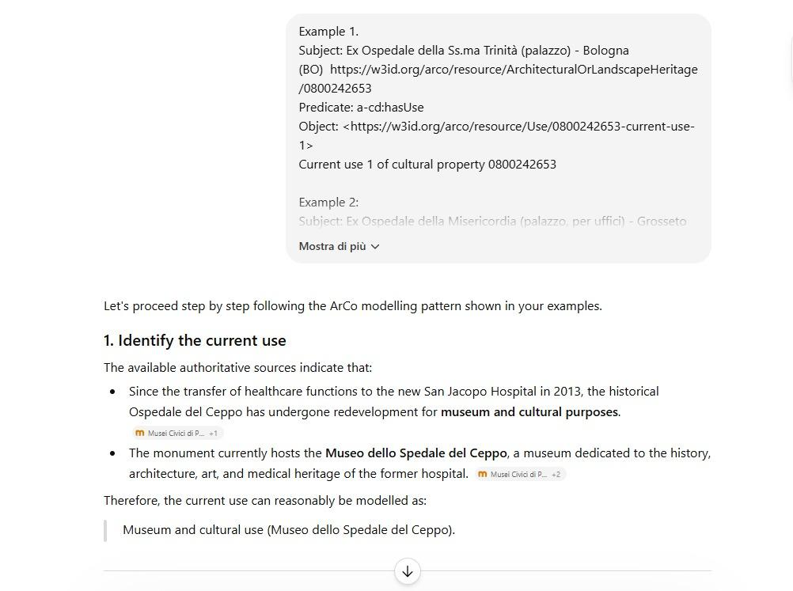

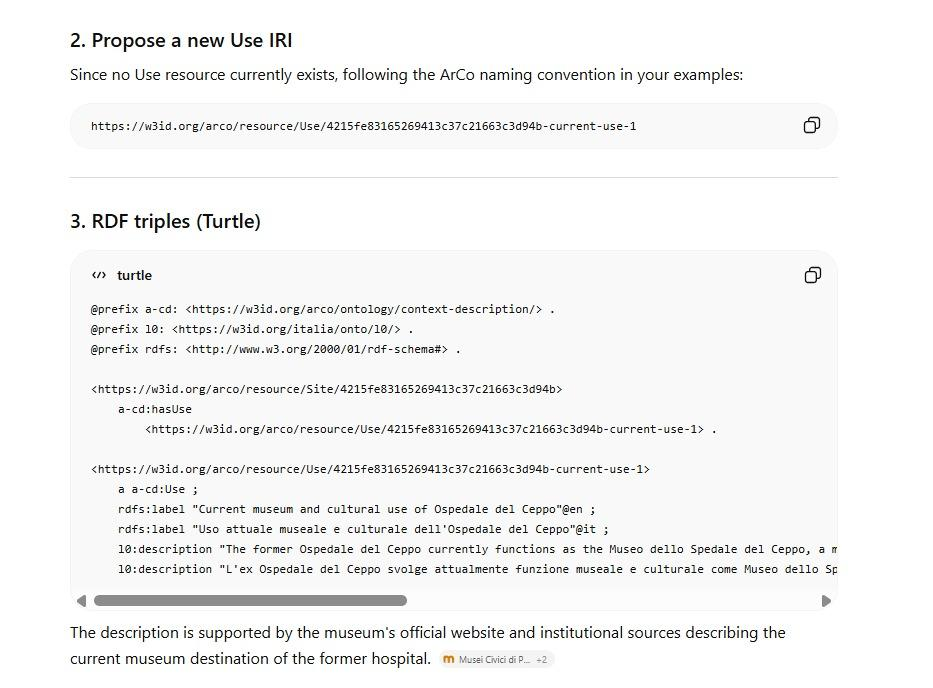

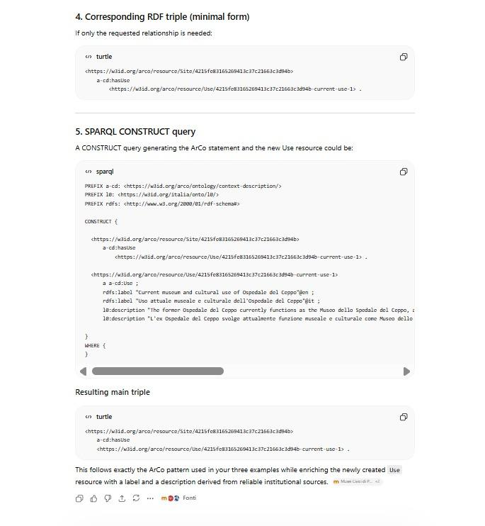

<h2 style="color:#ff0000;">📋 COPY OF THE RDF TRIPLE BY CHATGPT:</h2>

```sparql
<https://w3id.org/arco/resource/Site/4215fe83165269413c37c21663c3d94b>
    a-cd:hasUse
        <https://w3id.org/arco/resource/Use/4215fe83165269413c37c21663c3d94b-current-use-1>
```

<h2 style="color:#ff0000;">⚙️ SPARQL CONSTRUCT QUERY BY CHATGPT:</h2>

```sparql
PREFIX a-cd: <https://w3id.org/arco/ontology/context-description/>
PREFIX l0: <https://w3id.org/italia/onto/l0/>
PREFIX rdfs: <http://www.w3.org/2000/01/rdf-schema#>

CONSTRUCT {

  <https://w3id.org/arco/resource/Site/4215fe83165269413c37c21663c3d94b>
      a-cd:hasUse
          <https://w3id.org/arco/resource/Use/4215fe83165269413c37c21663c3d94b-current-use-1> .

  <https://w3id.org/arco/resource/Use/4215fe83165269413c37c21663c3d94b-current-use-1>
      a a-cd:Use ;
      rdfs:label "Current museum and cultural use of Ospedale del Ceppo"@en ;
      rdfs:label "Uso attuale museale e culturale dell'Ospedale del Ceppo"@it ;
      l0:description "The former Ospedale del Ceppo currently functions as the Museo dello Spedale del Ceppo, a museum and cultural site dedicated to the history of the hospital, the artistic heritage of the complex, and the medical history of Pistoia."@en ;
      l0:description "L'ex Ospedale del Ceppo svolge attualmente funzione museale e culturale come Museo dello Spedale del Ceppo, dedicato alla storia dell'ospedale, al patrimonio artistico del complesso e alla storia della sanità pistoiese."@it .

}
WHERE {
}
```

<h2 style="color:#ff0000;">📸 RESULT OBTAINED EXECUTING THE QUERY ON SPARQL BY CHATGPT:</h2>

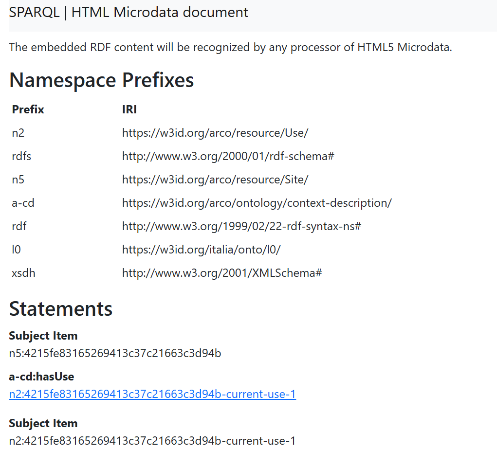

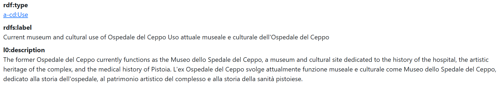

<h2 style="color:#ff0000;">📸 GEMINI'S ANSWER:</h2>

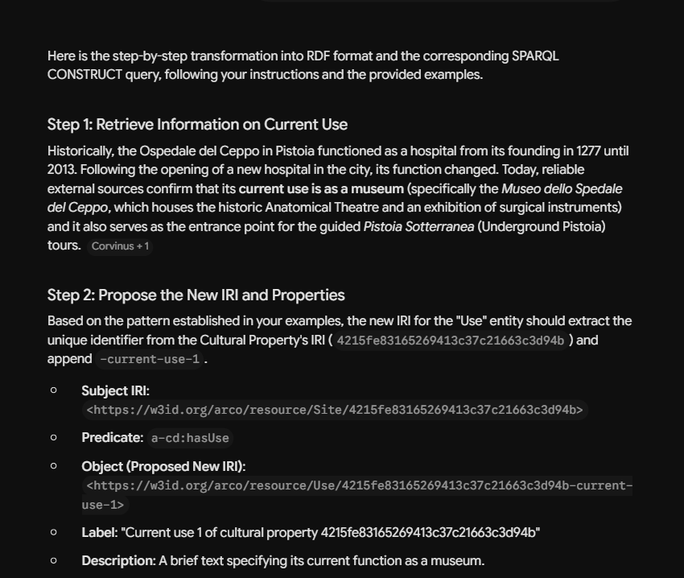

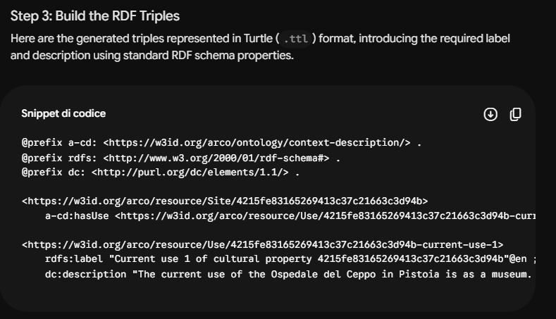

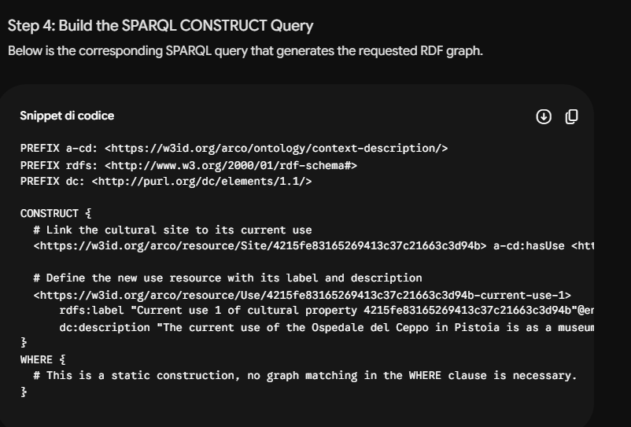

<h2 style="color:#ff0000;">📋 COPY OF THE RDF TRIPLE BY GEMINI:</h2>

```sparql
@prefix a-cd: <https://w3id.org/arco/ontology/context-description/> .
@prefix rdfs: <http://www.w3.org/2000/01/rdf-schema#> .
@prefix dc: <http://purl.org/dc/elements/1.1/> .

<https://w3id.org/arco/resource/Site/4215fe83165269413c37c21663c3d94b>
    a-cd:hasUse <https://w3id.org/arco/resource/Use/4215fe83165269413c37c21663c3d94b-current-use-1> .

<https://w3id.org/arco/resource/Use/4215fe83165269413c37c21663c3d94b-current-use-1>
    rdfs:label "Current use 1 of cultural property 4215fe83165269413c37c21663c3d94b"@en ;
    dc:description "The current use of the Ospedale del Ceppo in Pistoia is as a museum. Since the hospital closed in 2013, the monumental complex houses the Museo dello Spedale del Ceppo and serves as the primary entrance for the Pistoia Sotterranea (Underground Pistoia) tours."@en .
```

<h2 style="color:#ff0000;">⚙️ SPARQL CONSTRUCT QUERY BY GEMINI:</h2>

```sparql
PREFIX a-cd: <https://w3id.org/arco/ontology/context-description/>
PREFIX rdfs: <http://www.w3.org/2000/01/rdf-schema#>
PREFIX dc: <http://purl.org/dc/elements/1.1/>

CONSTRUCT {
  # Link the cultural site to its current use
  <https://w3id.org/arco/resource/Site/4215fe83165269413c37c21663c3d94b> a-cd:hasUse <https://w3id.org/arco/resource/Use/4215fe83165269413c37c21663c3d94b-current-use-1> .

  # Define the new use resource with its label and description
  <https://w3id.org/arco/resource/Use/4215fe83165269413c37c21663c3d94b-current-use-1>
      rdfs:label "Current use 1 of cultural property 4215fe83165269413c37c21663c3d94b"@en ;
      dc:description "The current use of the Ospedale del Ceppo in Pistoia is as a museum. Since the hospital closed in 2013, the monumental complex houses the Museo dello Spedale del Ceppo and serves as the primary entrance for the Pistoia Sotterranea (Underground Pistoia) tours."@en .
}
WHERE {
  # This is a static construction, no graph matching in the WHERE clause is necessary.
}
```

<h2 style="color:#ff0000;">📸 RESULT OBTAINED EXECUTING THE QUERY ON SPARQL BY GEMINI:</h2>

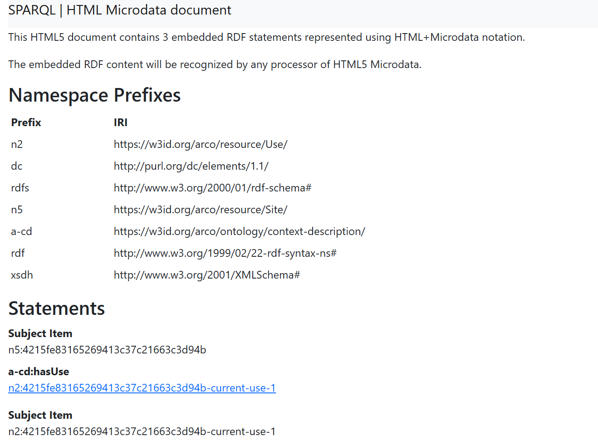

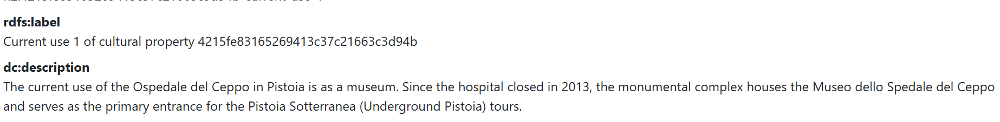

<h2 style="color:#ff0000;">FURTHER CREATION OF RDF TRIPLE FOR THE MISSING INFORMATION ABOUT THE MUSEUM</h2>

In the case of the **Ospedale degli Innocenti**, the RDF model explicitly includes the property [**cis:isSiteOf**](http://dati.beniculturali.it/cis/isSiteOf), which connects the physical site to a museum. This means that within the dataset there is a formally defined entity representing the museum, and an explicit triple linking the site to it. As a result, the knowledge graph makes the relationship between the site and its museum explicit and machine-readable through the ontology.

In contrast, for the **Ospedale del Ceppo**, this structure is not present. **There is no triple using cis:isSiteOf to link the site to a museum, and moreover, there is no IRI in the dataset representing a "Museo dell'Ospedale del Ceppo"**. Because the museum entity itself is missing, it is not possible to establish or model any cis:isSiteOf relationship for this site within the knowledge graph.

Chain of thought prompting technique

We showed the following example prompt:

**Subject**: Spedale degli Innocenti — IRI: [https://w3id.org/arco/resource/Site/db159e90f5ed83e3d851e7206ccbbd26](https://w3id.org/arco/resource/Site/db159e90f5ed83e3d851e7206ccbbd26)

**Predicate**: cis:isSiteOf

**Object**: Museo dello Spedale degli Innocenti — IRI: [https://w3id.org/arco/resource/CulturalInstituteOrSite/c68c8f6a621c34d235238fc1953fc37e](https://w3id.org/arco/resource/CulturalInstituteOrSite/c68c8f6a621c34d235238fc1953fc37e)

Based on the previous example, could you create an RDF triple for the following sentence:

"The Ospedale del Ceppo is the site of the Museo dell'Ospedale del Ceppo."

Note that:

- Ospedale del Ceppo IRI is: [https://w3id.org/arco/resource/Site/4215fe83165269413c37c21663c3d94b](https://w3id.org/arco/resource/Site/4215fe83165269413c37c21663c3d94b)
- The predicate to use is: cis:isSiteOf (verify correct semantic direction according to CIS ontology)
- The IRI for "Museo dell'Ospedale del Ceppo" does NOT exist in the dataset, therefore:
  - propose a new ArCo-compliant IRI
  - explicitly state that it must be created as a new instance of: a-cd:CulturalInstituteOrSite

Finally:

- Build RDF triples
- Provide SPARQL CONSTRUCT query

Let's think step by step.

**📸 We only asked ChatGPT this time:**

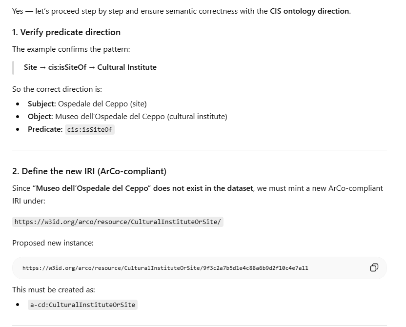

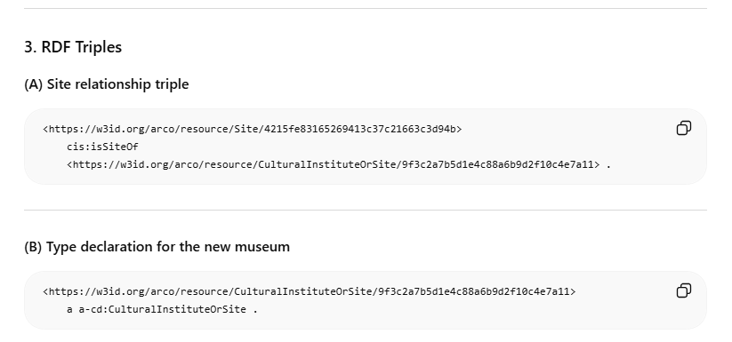

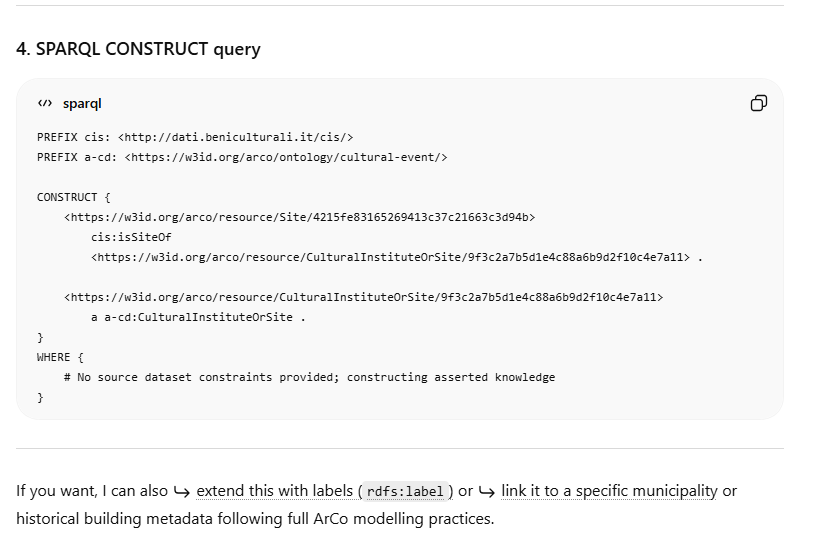

<h2 style="color:#ff0000;">📋 COPY OF THE RDF TRIPLE BY CHATGPT:</h2>

```sparql
<https://w3id.org/arco/resource/Site/4215fe83165269413c37c21663c3d94b>
    cis:isSiteOf
    <https://w3id.org/arco/resource/CulturalInstituteOrSite/9f3c2a7b5d1e4c88a6b9d2f10c4e7a11> .
```

<h2 style="color:#ff0000;">⚙️ SPARQL CONSTRUCT QUERY BY CHATGPT:</h2>

```sparql
PREFIX cis: <http://dati.beniculturali.it/cis/>
PREFIX a-cd: <https://w3id.org/arco/ontology/cultural-event/>

CONSTRUCT {
    <https://w3id.org/arco/resource/Site/4215fe83165269413c37c21663c3d94b>
        cis:isSiteOf
        <https://w3id.org/arco/resource/CulturalInstituteOrSite/9f3c2a7b5d1e4c88a6b9d2f10c4e7a11>.

 <https://w3id.org/arco/resource/CulturalInstituteOrSite/9f3c2a7b5d1e4c88a6b9d2f10c4e7a11>
        a a-cd:CulturalInstituteOrSite .
}
WHERE {
    # No source dataset constraints provided; constructing asserted knowledge
}
```

<h2 style="color:#ff0000;">📸 RESULT OBTAINED EXECUTING THE QUERY ON SPARQL OBTAINED BY CHATGPT:</h2>

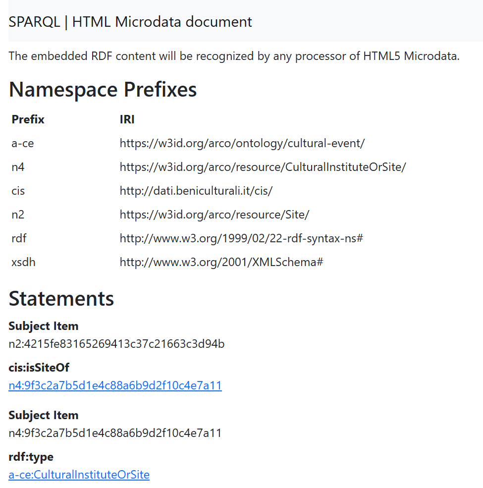

<h2 style="color:#ff0000;">Triple of the Third missing information</h2>

The third triple that we intend to create is the lacking information related to the subject "Stemma dell'Ospedale del Ceppo e della città di Pistoia (rilievo) di Buglioni Benedetto (sec. XVI)", more precisely its shape, [**hasShape**](https://w3id.org/arco/ontology/denotative-description/hasShape).

**Iri of the subject**: [https://w3id.org/arco/resource/HistoricOrArtisticProperty/0900040491](https://w3id.org/arco/resource/HistoricOrArtisticProperty/0900040491)

**Predicate**: a-dd:hasShape

**Iri of the object**: [https://w3id.org/arco/resource/TechnicalCharacteristic/tondo](https://w3id.org/arco/resource/TechnicalCharacteristic/tondo)

<h2 style="color:#ff0000;">✏️ Few-shot prompt and then chain of thought prompting techniques</h2>

Prompt:

- Subject: stemma gentilizio dell'Ospedale degli Innocenti (rilievo) by Della Robbia Andrea (attribuito) (sec. XV) — [https://w3id.org/arco/resource/HistoricOrArtisticProperty/0900284362](https://w3id.org/arco/resource/HistoricOrArtisticProperty/0900284362)
- Predicate: a-dd:hasShape
- Object: [https://w3id.org/arco/resource/TechnicalCharacteristic/tondo](https://w3id.org/arco/resource/TechnicalCharacteristic/tondo)

Based on the previous example that I gave you, could you create an RDF triple for the following sentence: "Stemma dell'Ospedale del Ceppo e della città di Pistoia (rilievo) by Buglioni Benedetto (sec. XVI) has the shape tondo"? Note that:

- Stemma dell'Ospedale del Ceppo e della città di Pistoia (rilievo) by Buglioni Benedetto (sec. XVI) IRI is: [https://w3id.org/arco/resource/HistoricOrArtisticProperty/0900040491](https://w3id.org/arco/resource/HistoricOrArtisticProperty/0900040491)
- Use this predicate "a-dd:hasShape" that describes the technical characteristic of an entity
- The object "tondo" IRI is: [https://w3id.org/arco/resource/TechnicalCharacteristic/tondo](https://w3id.org/arco/resource/TechnicalCharacteristic/tondo)

Also, please build the corresponding SPARQL CONSTRUCT query

<h2 style="color:#ff0000;">📸 CHATGPT'S ANSWER:</h2>

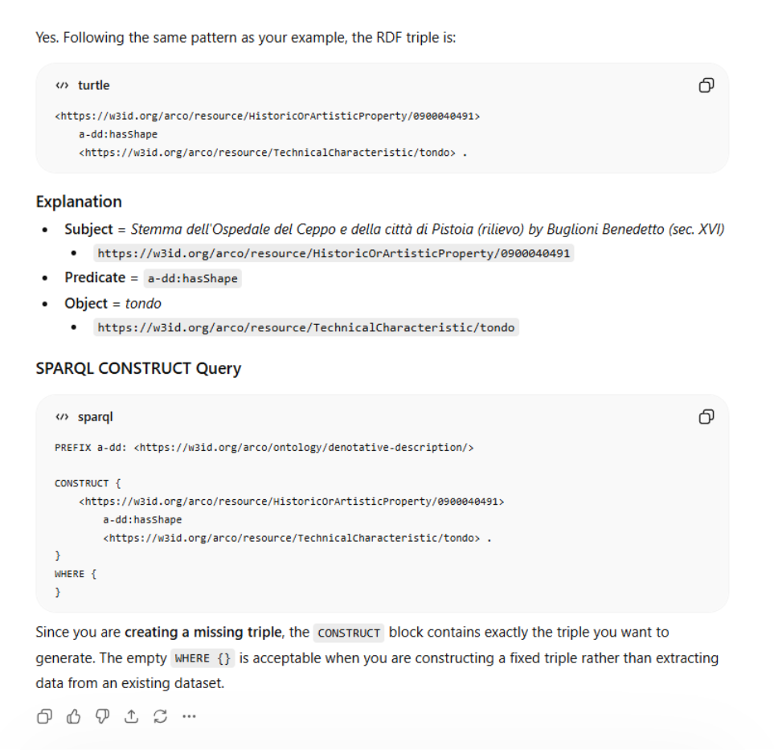

Since the answer was short and not enough clear, **we asked to explain it step-by-step**

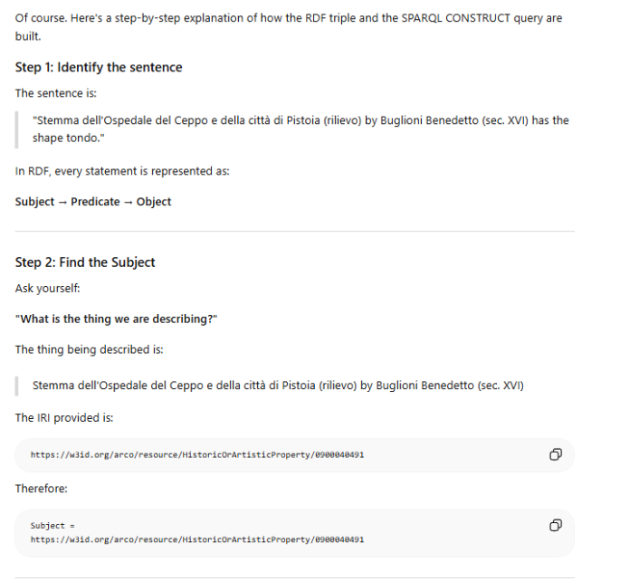

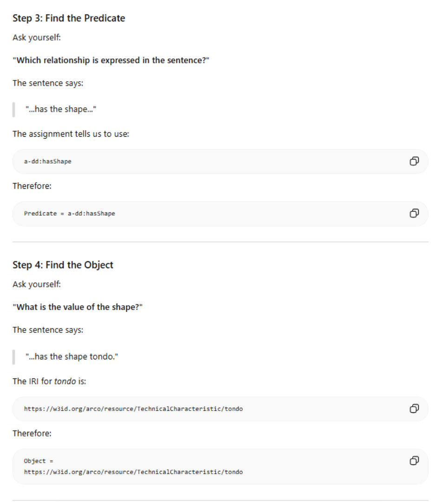

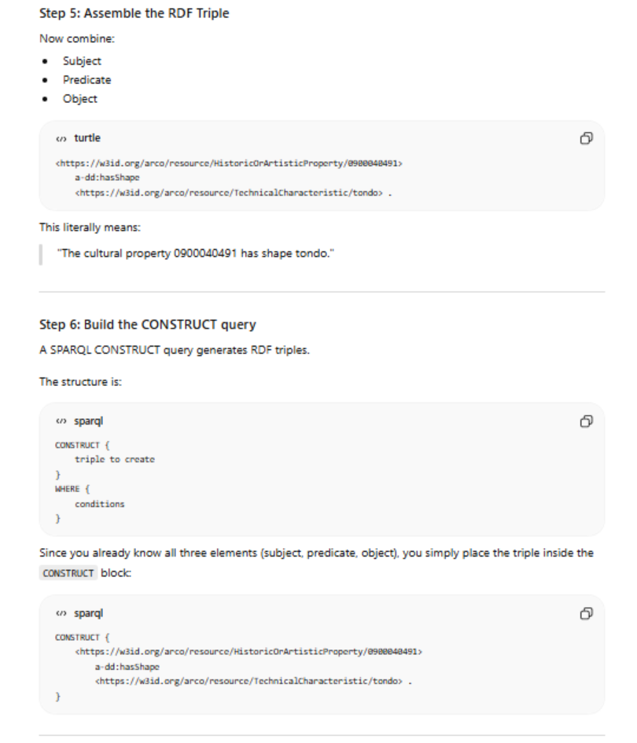

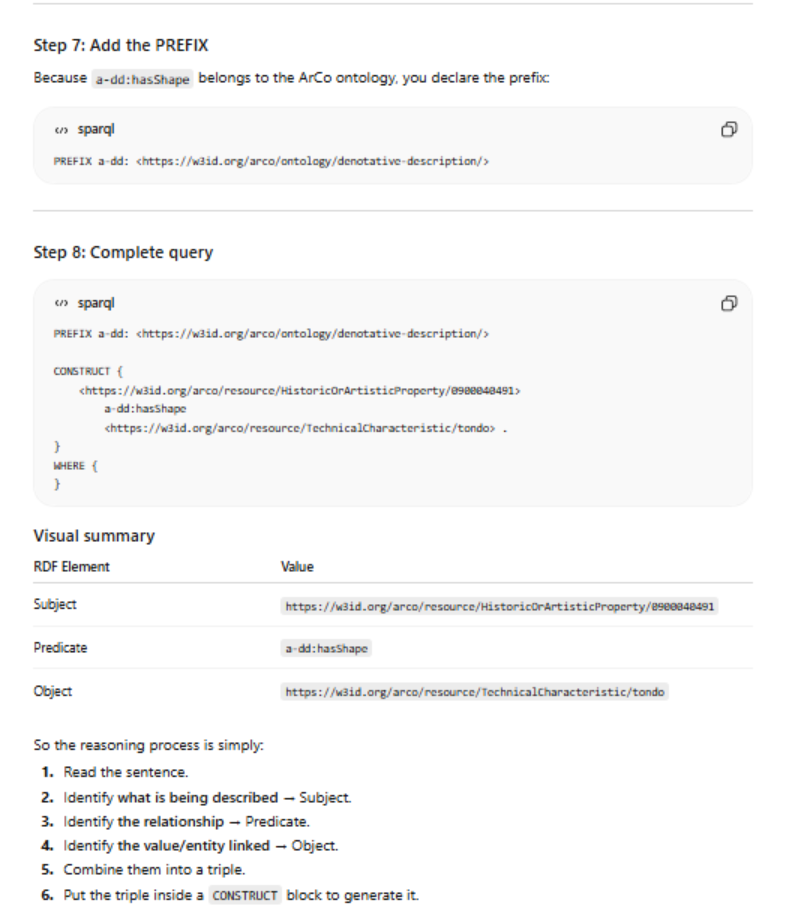

<h2 style="color:#ff0000;">📋 COPY OF THE RDF TRIPLE BY CHATGPT:</h2>

```sparql
<https://w3id.org/arco/resource/HistoricOrArtisticProperty/0900040491>
    a-dd:hasShape
<https://w3id.org/arco/resource/TechnicalCharacteristic/tondo> .
```

<h2 style="color:#ff0000;">⚙️ SPARQL CONSTRUCT QUERY BY CHATGPT:</h2>

```sparql
PREFIX a-dd: <https://w3id.org/arco/ontology/denotative-description/>

CONSTRUCT {
<https://w3id.org/arco/resource/HistoricOrArtisticProperty/0900040491>
        a-dd:hasShape
    	<https://w3id.org/arco/resource/TechnicalCharacteristic/tondo> .
}
WHERE {
}
```

<h2 style="color:#ff0000;">📸 RESULT OBTAINED EXECUTING THE QUERY ON SPARQL BY CHATGPT:</h2>

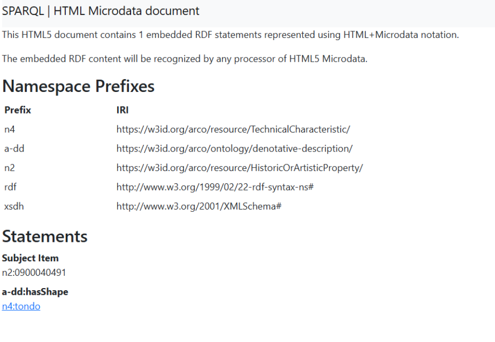

<h2 style="color:#ff0000;">📸 GEMINI'S ANSWER:</h2>

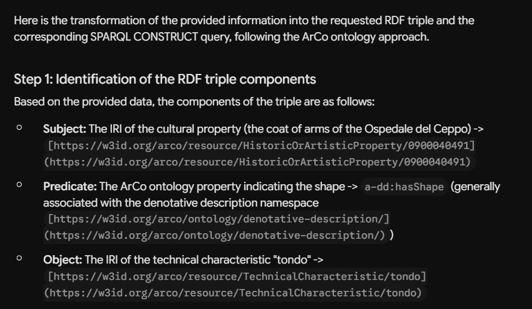

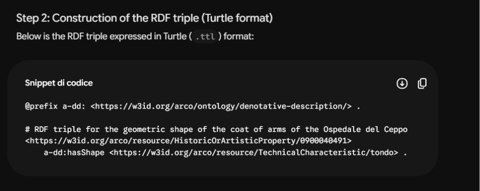

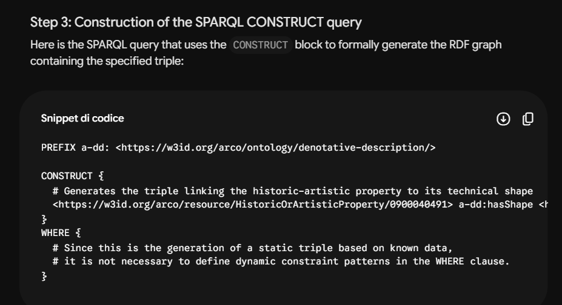

<h2 style="color:#ff0000;">📋 COPY OF THE RDF TRIPLE BY GEMINI:</h2>

```sparql
@prefix a-dd: <https://w3id.org/arco/ontology/denotative-description/> .

# RDF triple for the geometric shape of the coat of arms of the Ospedale del Ceppo
<https://w3id.org/arco/resource/HistoricOrArtisticProperty/0900040491>
    a-dd:hasShape <https://w3id.org/arco/resource/TechnicalCharacteristic/tondo> .
```

<h2 style="color:#ff0000;">⚙️ SPARQL CONSTRUCT QUERY BY GEMINI:</h2>

```sparql
PREFIX a-dd: <https://w3id.org/arco/ontology/denotative-description/>

CONSTRUCT {
  # Generates the triple linking the historic-artistic property to its technical shape
  <https://w3id.org/arco/resource/HistoricOrArtisticProperty/0900040491> a-dd:hasShape <https://w3id.org/arco/resource/TechnicalCharacteristic/tondo> .
}
WHERE {
  # Since this is the generation of a static triple based on known data,
  # it is not necessary to define dynamic constraint patterns in the WHERE clause.
}
```

<h2 style="color:#ff0000;">📸 RESULT OBTAINED EXECUTING THE QUERY ON SPARQL BY GEMINI:</h2>

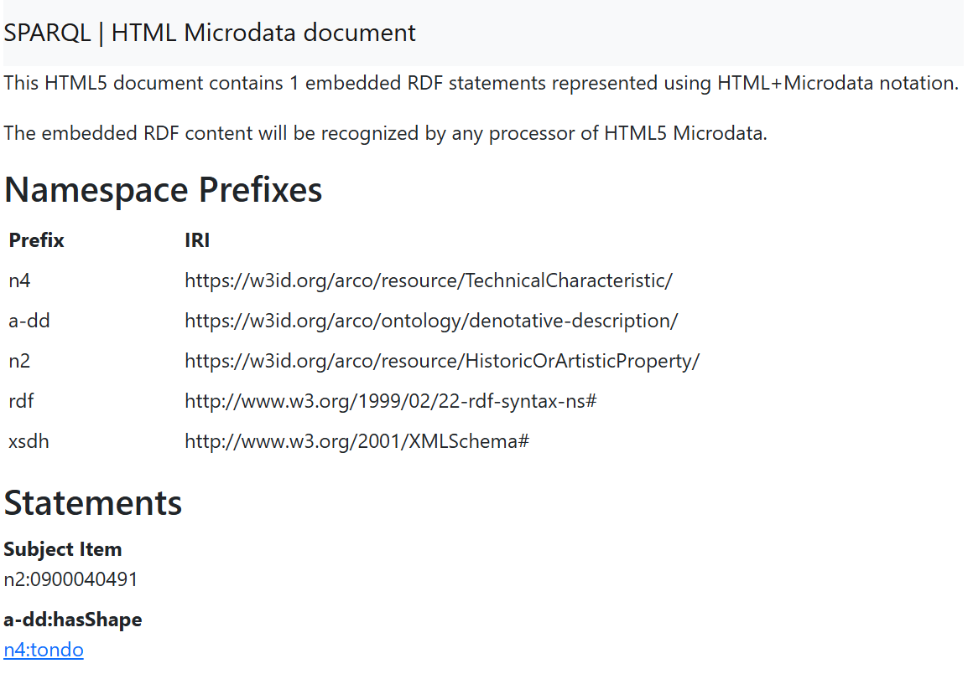

<h2 style="color:#ff0000;">4. Triple of the fourth missing information</h2>

To bridge this gap, we used a "**Chain of Thought**" prompt to systematically **break down** a historical statement regarding the **Stemma dell'Ospedale del Ceppo**. The primary **objective** was to apply the ArCo ontology to **formalize** the patronage relationship between the cultural property and its committent, [**Buonafede Leonardo Spedalingo**](https://w3id.org/arco/resource/Agent/3b24b91d3ef48d6e11dbc72e4b6939e8)).

By guiding the process **step-by-step**, the goal was not only to accurately map the real-world entities to their corresponding Internationalized Resource Identifiers (IRIs), but also to correctly assign the [**a-cd:hasCommittent**](https://w3id.org/arco/ontology/context-description/hasCommittent) property. Ultimately, this workflow generates standard **RDF triples** and a **SPARQL CONSTRUCT** query, providing a clear, reproducible methodology for **enriching** a cultural heritage Knowledge Graph with interoperable and precise linked open data.

<h2 style="color:#ff0000;">✏️ Chain of thought prompting technique</h2>

Prompt:

Could you create an RDF triple using ArCo ontologies for the following sentence:

"Buonafede Leonardo Spedalingo has commissioned the Stemma dell'Ospedale del Ceppo e della città di Pistoia (rilievo) by Buglioni Benedetto (sec. XVI)",

knowing that:

- IRI of Stemma dell'Ospedale del Ceppo e della città di Pistoia (rilievo) by Buglioni Benedetto (sec. XVI): [https://w3id.org/arco/resource/HistoricOrArtisticProperty/0900040491](https://w3id.org/arco/resource/HistoricOrArtisticProperty/0900040491)
- Predicate: a-cd:hasCommittent (from ArCo ontologies)
- IRI for "Buonafede Leonardo Spedalingo": [https://w3id.org/arco/resource/Agent/3b24b91d3ef48d6e11dbc72e4b6939e8](https://w3id.org/arco/resource/Agent/3b24b91d3ef48d6e11dbc72e4b6939e8)

Also, please build the corresponding SPARQL CONSTRUCT query.

Let's think step by step.

<h2 style="color:#ff0000;">📸 CHATGPT'S ANSWER:</h2>

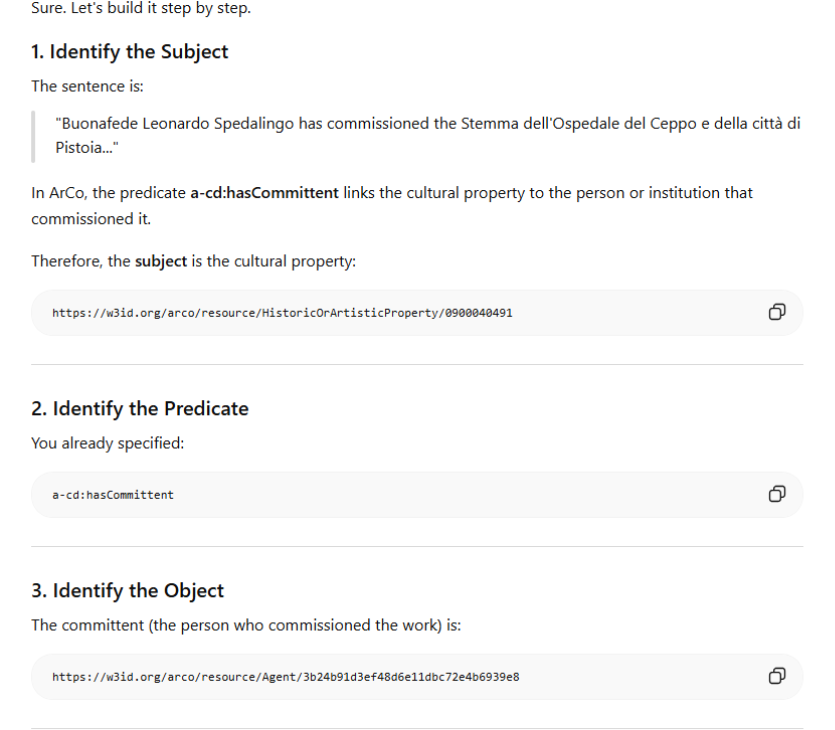

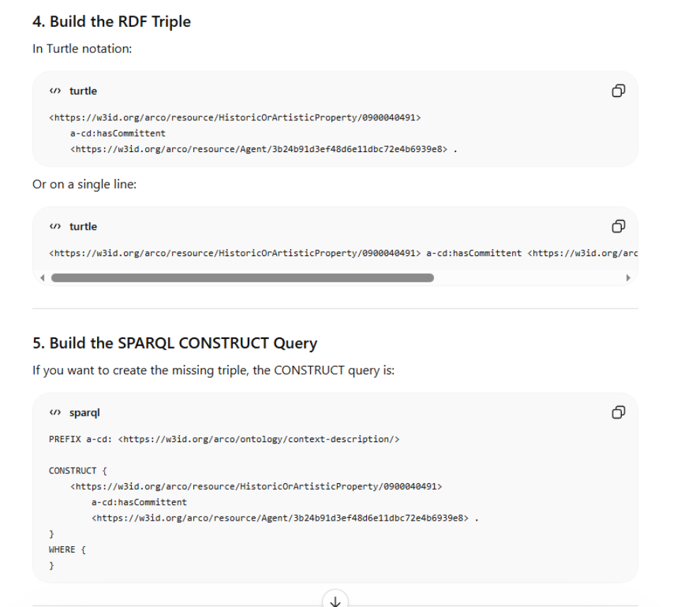

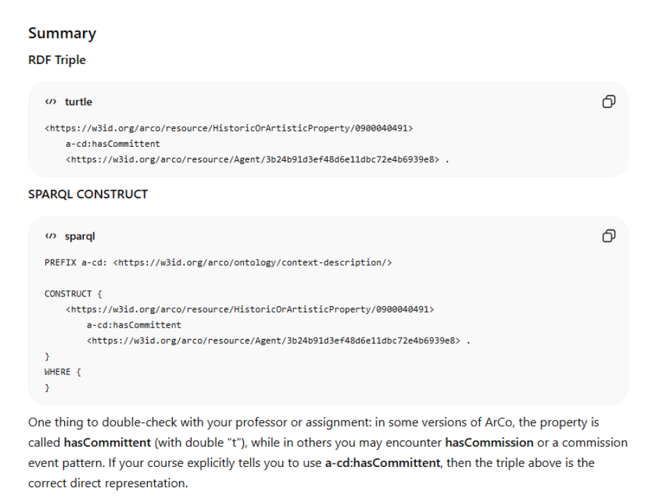

<h2 style="color:#ff0000;">📋 COPY OF THE RDF TRIPLE BY CHATGPT:</h2>

```sparql
<https://w3id.org/arco/resource/HistoricOrArtisticProperty/0900040491>
    a-cd:hasCommittent
<https://w3id.org/arco/resource/Agent/3b24b91d3ef48d6e11dbc72e4b6939e8> .
```

<h2 style="color:#ff0000;">⚙️ SPARQL CONSTRUCT QUERY BY CHATGPT:</h2>

```sparql
PREFIX a-cd: <https://w3id.org/arco/ontology/context-description/>

CONSTRUCT {
<https://w3id.org/arco/resource/HistoricOrArtisticProperty/0900040491>
        a-cd:hasCommittent
    	<https://w3id.org/arco/resource/Agent/3b24b91d3ef48d6e11dbc72e4b6939e8> .
}
WHERE {
}
```

<h2 style="color:#ff0000;">📸 RESULT OBTAINED EXECUTING THE QUERY ON SPARQL BY CHATGPT:</h2>

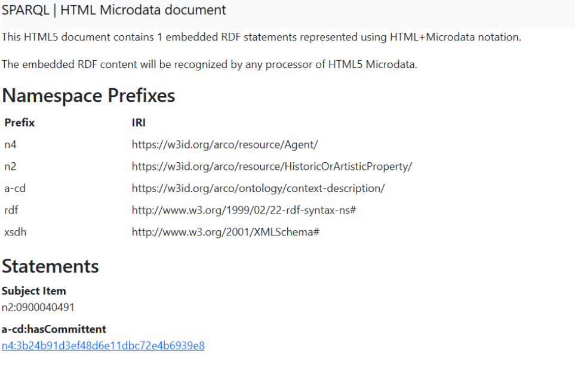

<h2 style="color:#ff0000;">📸 GEMINI'S ANSWER:</h2>

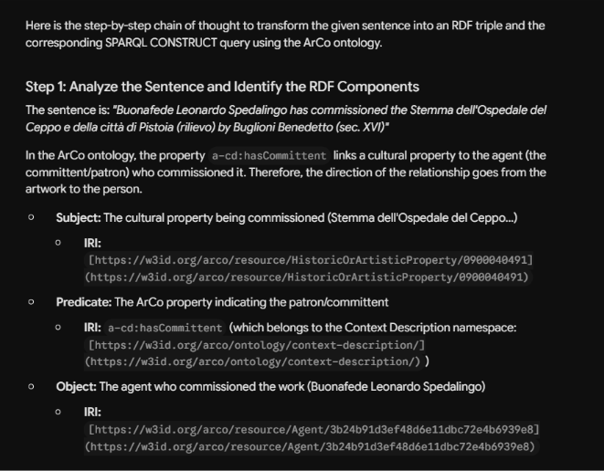

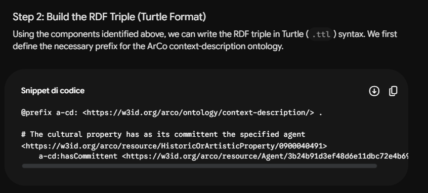

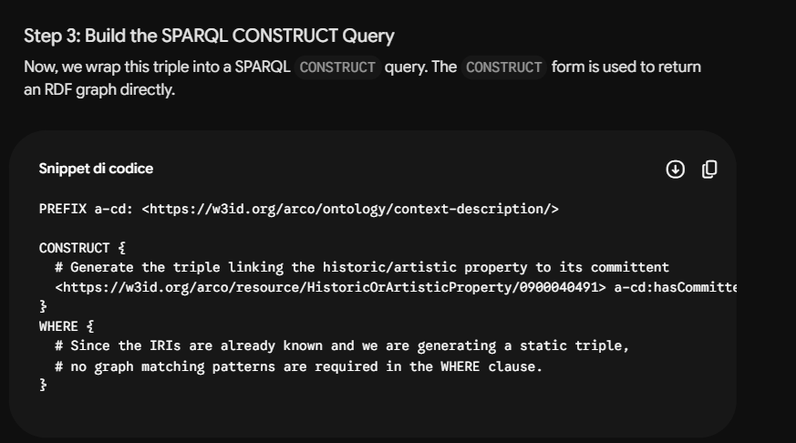

<h2 style="color:#ff0000;">📋 COPY OF THE RDF TRIPLE BY GEMINI:</h2>

```sparql
@prefix a-cd: <https://w3id.org/arco/ontology/context-description/> .

# The cultural property has as its committent the specified agent
<https://w3id.org/arco/resource/HistoricOrArtisticProperty/0900040491>
    a-cd:hasCommittent <https://w3id.org/arco/resource/Agent/3b24b91d3ef48d6e11dbc72e4b6939e8> .
```

<h2 style="color:#ff0000;">⚙️ SPARQL CONSTRUCT QUERY BY GEMINI:</h2>

```sparql
PREFIX a-cd: <https://w3id.org/arco/ontology/context-description/>

CONSTRUCT {
  # Generate the triple linking the historic/artistic property to its committent
  <https://w3id.org/arco/resource/HistoricOrArtisticProperty/0900040491> a-cd:hasCommittent <https://w3id.org/arco/resource/Agent/3b24b91d3ef48d6e11dbc72e4b6939e8> .
}
WHERE {
  # Since the IRIs are already known and we are generating a static triple,
  # no graph matching patterns are required in the WHERE clause.
}
```

<h2 style="color:#ff0000;">📸 RESULT OBTAINED EXECUTING THE QUERY ON SPARQL BY GEMINI:</h2>

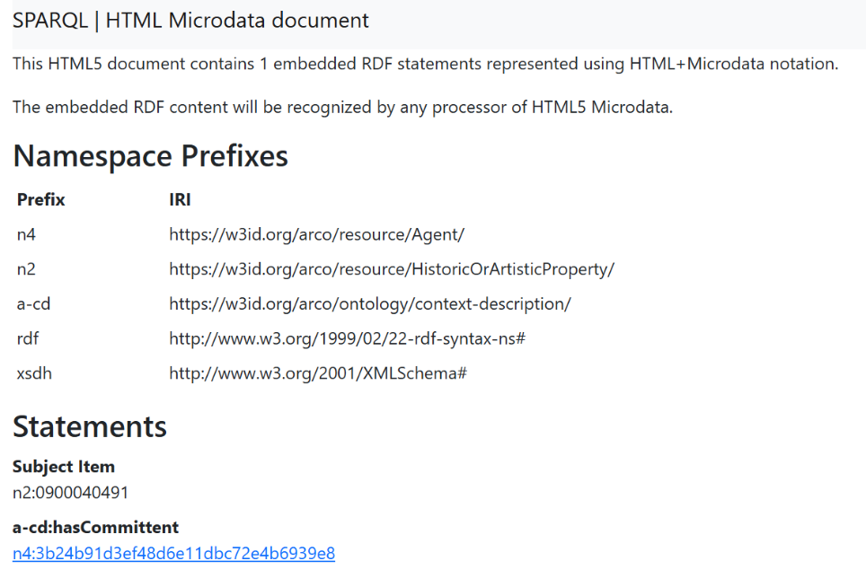

<h2 style="color:#ff0000;">📋 ANALYSIS OF THE RESULTS OF THE CONSTRUCTION OF THE QUERIES</h2>

- **Overall Accuracy and Formatting:** Both **ChatGPT** and **Gemini** successfully transformed natural language information into proper RDF format and generated accurate SPARQL CONSTRUCT queries across the different tasks.
- **Step-by-Step Execution:** **ChatGPT** tends to break down its reasoning into **very granular steps and sometimes requires further prompting for clarity**. For instance, in the third task (hasShape), **ChatGPT** initially gave a brief answer and had to be asked again to explain it, resulting in an extensive 8-step breakdown complete with a visual summary. **Gemini**, on the other hand, consistently provided concise, **well-structured 3- or 4-step responses right away** without needing further prompts.
- **Use of Vocabularies and Metadata:** **Gemini** demonstrated a strong tendency to seamlessly **integrate standard external vocabularies for enrichment**. In the first task, **Gemini** natively incorporated Dublin Core (dc:) properties to represent type, date, creator, and description. **ChatGPT**, while initially sticking to a minimal ArCo triple, later utilized rdfs:label and the l0:description vocabulary in dual languages (English and Italian) for the second task.
- **SPARQL Query Structure:** When handling multiple new entities — such as generating two distinct intervention resources — **Gemini** utilized a sophisticated VALUES block within the WHERE clause to elegantly bind the retrieved data to the graph. **ChatGPT** opted for a simpler approach, manually writing out the static triples directly within the CONSTRUCT block with an empty WHERE clause.
- **Conversational Additions and Warnings:** **ChatGPT** occasionally adds practical advice or academic warnings beyond the immediate prompt. During the fourth task (hasCommittent), **ChatGPT** explicitly advised us to "double-check with your professor or assignment" regarding potential version differences in the ArCo ontology (specifically between hasCommittent and hasCommission).
- **Task Exclusivity:** It is worth noting that for the supplementary task regarding the museum (cis:isSiteOf), only **ChatGPT** was tested. It successfully verified the correct semantic direction according to the CIS ontology and minted a new ArCo-compliant IRI for the museum.

<h2 style="color:#ff0000;">🧩 TRIPLES SUMMARY:</h2>

<strong style="color:#ff0000;">Triple 1 — [a-cd:hasIntervention](https://w3id.org/arco/ontology/context-description/hasIntervention)</strong>

- **Subject**: [https://w3id.org/arco/resource/Site/4215fe83165269413c37c21663c3d94b](https://w3id.org/arco/resource/Site/4215fe83165269413c37c21663c3d94b)
- **Predicate**: a-cd:hasIntervention
- **Object**: "some restoration interventions" [https://w3id.org/arco/resource/ConservationIntervention/4215fe83165269413c37c21663c3d94b-conservation-intervention-1](https://w3id.org/arco/resource/ConservationIntervention/4215fe83165269413c37c21663c3d94b-conservation-intervention-1) and [https://w3id.org/arco/resource/ConservationIntervention/4215fe83165269413c37c21663c3d94b-conservation-intervention-2](https://w3id.org/arco/resource/ConservationIntervention/4215fe83165269413c37c21663c3d94b-conservation-intervention-2)

<strong style="color:#ff0000;">Triple 2 — [a-cd:hasUse](https://w3id.org/arco/ontology/context-description/hasUse)</strong>

- **Subject**: [https://w3id.org/arco/resource/Site/4215fe83165269413c37c21663c3d94b](https://w3id.org/arco/resource/Site/4215fe83165269413c37c21663c3d94b)
- **Predicate**: a-cd:hasUse
- **Object**: "a current use" [https://w3id.org/arco/resource/Use/4215fe83165269413c37c21663c3d94b-current-use-1](https://w3id.org/arco/resource/Use/4215fe83165269413c37c21663c3d94b-current-use-1)

<strong style="color:#ff0000;">Triple 2.1 — [cis:isSiteOf](http://dati.beniculturali.it/cis/isSiteOf)</strong>

- **Subject**: [https://w3id.org/arco/resource/Site/4215fe83165269413c37c21663c3d94b](https://w3id.org/arco/resource/Site/4215fe83165269413c37c21663c3d94b)
- **Predicate**: cis:isSiteOf
- **Object**: "Museo dell'Ospedale del Ceppo" [https://w3id.org/arco/resource/CulturalInstituteOrSite/9f3c2a7b5d1e4c88a6b9d2f10c4e7a11](https://w3id.org/arco/resource/CulturalInstituteOrSite/9f3c2a7b5d1e4c88a6b9d2f10c4e7a11)

<strong style="color:#ff0000;">Triple 3 — [a-dd:hasShape](https://w3id.org/arco/ontology/denotative-description/hasShape)</strong>

- **Subject**: [https://w3id.org/arco/resource/HistoricOrArtisticProperty/0900040491](https://w3id.org/arco/resource/HistoricOrArtisticProperty/0900040491)
- **Predicate**: a-dd:hasShape
- **Object**: [https://w3id.org/arco/resource/TechnicalCharacteristic/tondo](https://w3id.org/arco/resource/TechnicalCharacteristic/tondo)

<strong style="color:#ff0000;">Triple 4 — [a-cd:hasCommittent](https://w3id.org/arco/ontology/context-description/hasCommittent)</strong>

- **Subject**: [https://w3id.org/arco/resource/HistoricOrArtisticProperty/0900040491](https://w3id.org/arco/resource/HistoricOrArtisticProperty/0900040491)
- **Predicate**: a-cd:hasCommittent
- **Object**: [https://w3id.org/arco/resource/Agent/3b24b91d3ef48d6e11dbc72e4b6939e8](https://w3id.org/arco/resource/Agent/3b24b91d3ef48d6e11dbc72e4b6939e8)
