### Sections:

- [🏠 Home](index.html)
- [🏛️ Topic](topic.html)
- [⚒️ Semantic Methodology](methodology.html)
- [📈 SPARQL Queries & Data Results](sparql.html)
- [🧩 Gap Identification](gaps.html)
- [🤖 LLM Prompt: ChatGPT & Gemini](prompts.html)
- [🔗 RDF Triple Generation](rdf.html)
- [⚠️ Key Challenges](challenges.html)
- [🎯 Conclusions & Insights](conclusions.html)

<h1 style="color:#ff0000;">📈 SPARQL QUERIES & DATA RESULTS</h1>


<h2 style="color:#ff0000;">BUILDING THE QUERIES</h2>

<h2 style="color:#ff0000;">Query 1 — Does ArCo contain the topic of our project?</h2>

The first step was to verify whether the **ArCo Knowledge Graph** already contains an entity representing our selected topic, [**Spedale del Ceppo**](https://w3id.org/arco/resource/Site/4215fe83165269413c37c21663c3d94b)

<h3 style="color:#ff0000;">Keyword Selection for Query Building:</h3>

- **DISTINCT**: eliminates duplicate results.
- **FILTER** and **REGEX**: used to retrieve more specific information. **FILTER** restricts results based on conditions; **REGEX** enables pattern matching inside string values.
- **cp**: stands for Cultural Property.

<h3 style="color:#ff0000;">⚙️SPARQL Query:</h3>

```sparql
PREFIX rdf: <http://www.w3.org/1999/02/22-rdf-syntax-ns#>
PREFIX arco: <https://w3id.org/arco/ontology/arco/>
PREFIX a-cd: <https://w3id.org/arco/ontology/context-description/>

SELECT DISTINCT ?cp
WHERE {
?cp a arco:HistoricOrArtisticProperty ;
rdfs:label ?l .
FILTER(REGEX(?l, "Spedale del Ceppo", "i"))
}
```

<h3 style="color:#ff0000;">Screenshot of the results:</h3>

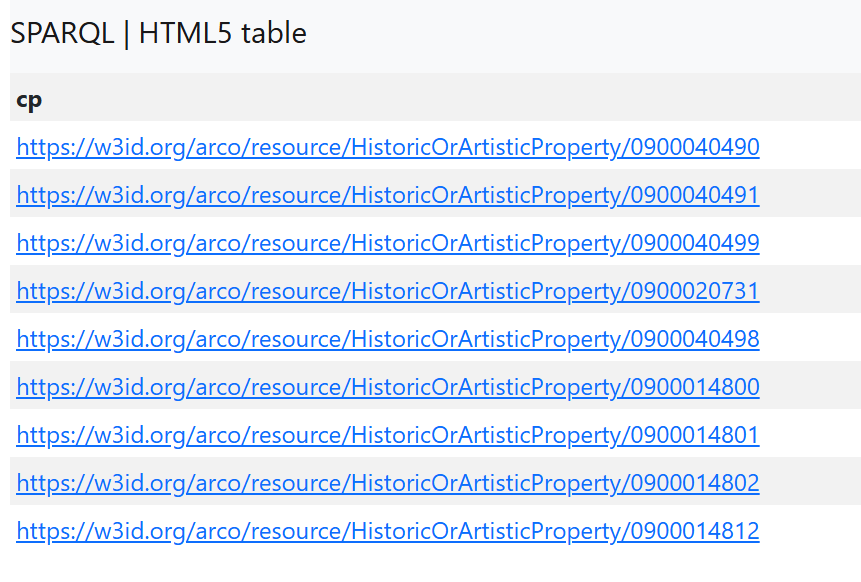

<h3 style="color:#ff0000;">IRIs Found:</h3>

- [stemma dell'Ospedale del Ceppo e dell'Ospedale di Santa Maria Nuova (rilievo) di Della Robbia Giovanni (sec. XVI)](https://w3id.org/arco/resource/HistoricOrArtisticProperty/0900040490)
- [stemma dell'Ospedale del Ceppo e della città di Pistoia (rilievo) di Buglioni Benedetto (sec. XVI)](https://w3id.org/arco/resource/HistoricOrArtisticProperty/0900040491)
- [stemma dell'Ospedale del Ceppo e dell'Ospedale di Santa Maria Nuova (rilievo) di Della Robbia Giovanni (sec. XVI)](https://w3id.org/arco/resource/HistoricOrArtisticProperty/0900040499)
- [stemma dell'Ospedale del Ceppo (decorazione) - bottega pistoiese (sec. XVIII)](https://w3id.org/arco/resource/HistoricOrArtisticProperty/0900020731)
- [stemma dell'Ospedale del Ceppo e della città di Pistoia (rilievo) di Della Robbia Giovanni (sec. XVI)](https://w3id.org/arco/resource/HistoricOrArtisticProperty/0900040498)
- [stemma dell'Ospedale del Ceppo (rilievo) - manifattura toscana (sec. XVI)](https://w3id.org/arco/resource/HistoricOrArtisticProperty/0900014800)
- [stemma dell'Ospedale del Ceppo (rilievo) - manifattura toscana (sec. XVI)](https://w3id.org/arco/resource/HistoricOrArtisticProperty/0900014801)
- [stemma dell'Ospedale del Ceppo (rilievo) - manifattura toscana (sec. XVI)](https://w3id.org/arco/resource/HistoricOrArtisticProperty/0900014802)
- [stemma dell'Ospedale del Ceppo (rilievo) - manifattura toscana (seconda metà sec. XVI)](https://w3id.org/arco/resource/HistoricOrArtisticProperty/0900014812)

### ✅ Discussion of results and further research:

Through this query we were able to confirm the presence of entities related to our topic in ArCo. More specifically, we found out that all the entities are the IRIs of the medallions. We decided to analyse one of the results of our query and we found the section "inverse relation"; among the properties we clicked on **is a-loc:isTimeIndexedTypedLocationOf of**.

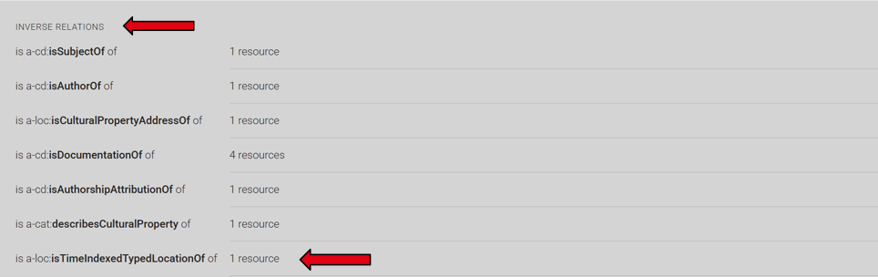

<h3 style="color:#ff0000;">Results:</h3>

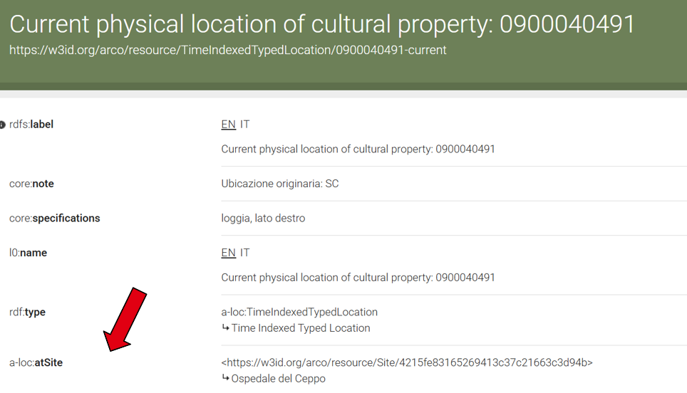

From this page, we were cheerfully able to find the official IRI of our topic:

Ospedale del Ceppo ([https://w3id.org/arco/resource/Site/4215fe83165269413c37c21663c3d94b](https://w3id.org/arco/resource/Site/4215fe83165269413c37c21663c3d94b))

<h3 style="color:#ff0000;">Conclusions from the first Query:</h3>

- we discovered that it is characterized as cis:Site.
- we found our subject, discovering that it is labelled as "Ospedale" and not as "Spedale".

<h2 style="color:#ff0000;">Query 2 — Finding depictions of the Ospedale del Ceppo</h2>

In this query, our goal was to retrieve information and **potential visual representations** (e.g., images) of the Ospedale del Ceppo ([https://w3id.org/arco/resource/Site/4215fe83165269413c37c21663c3d94b](https://w3id.org/arco/resource/Site/4215fe83165269413c37c21663c3d94b)) in Pistoia. We opted for **SELECT \*** to extract all possible variables from the matching records, and we used the **OPTIONAL** clause to fetch image data only when explicitly available.

Additionally, based on the insights gained from our first query regarding how the Ospedale del Ceppo is classified within the ontology, we introduced the **UNION** keyword to broaden our search across different entity types.

<h3 style="color:#ff0000;">Explanation of the keywords used:</h3>

- **UNION**: Combines results from two different graph patterns. We implemented this because Query 1 revealed that the hospital might be classified under two distinct classes: either as a historic/artistic property (arco:HistoricOrArtisticProperty) or as a general geographic site (cis:Site). UNION ensures we capture the entity regardless of which specific classification was used.
- **OPTIONAL**: Allows the inclusion of supplementary data (in this case, foaf:depiction) if it exists, without excluding results where the image information is missing.
- **\* (Asterisk)**: Retrieves every variable defined within the WHERE clause for each match, rather than limiting the output.
- **FILTER(REGEX)**: We used two separate regular expression filters to narrow down the results, ensuring the labels (?l) contain both "Ospedale del Ceppo" and "Pistoia". The "i" flag makes the search case-insensitive.

<h3 style="color:#ff0000;">SPARQL Query:</h3>

```sparql
PREFIX rdf: <http://www.w3.org/1999/02/22-rdf-syntax-ns#>
PREFIX rdfs: <http://www.w3.org/2000/01/rdf-schema#>
PREFIX arco: <https://w3id.org/arco/ontology/arco/>
PREFIX a-cd: <https://w3id.org/arco/ontology/context-description/>
PREFIX foaf: <http://xmlns.com/foaf/0.1/>
PREFIX cis: <https://w3id.org/arco/ontology/cis/>

SELECT *
WHERE {
  {
    ?cp a arco:HistoricOrArtisticProperty ;
        rdfs:label ?l .
  }
  UNION
  {
    ?cp a cis:Site ;
        rdfs:label ?l .
  }
  FILTER(REGEX(?l, "Ospedale del Ceppo", "i"))
  FILTER(REGEX(?l, "Pistoia", "i"))
  OPTIONAL { ?cp foaf:depiction ?depiction }
}
```

<h3 style="color:#ff0000;">Screenshot of Results:</h3>

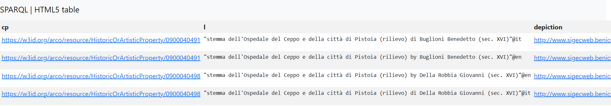

<h3 style="color:#ff0000;">Depictions found:</h3>

Stemma dell'Ospedale del Ceppo e della città di Pistoia (rilievo) by Buglioni Benedetto (sec. XVI) — [https://w3id.org/arco/resource/HistoricOrArtisticProperty/0900040491](https://w3id.org/arco/resource/HistoricOrArtisticProperty/0900040491)

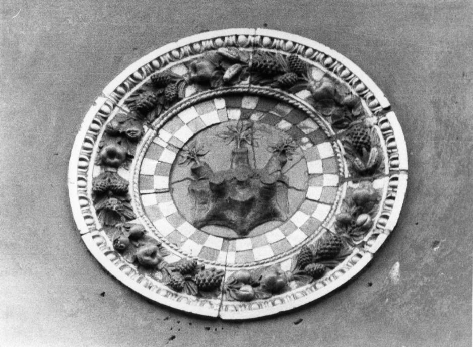

Stemma dell'Ospedale del Ceppo e della città di Pistoia (rilievo) by Della Robbia Giovanni (sec. XVI) — [https://w3id.org/arco/resource/HistoricOrArtisticProperty/0900040498](https://w3id.org/arco/resource/HistoricOrArtisticProperty/0900040498)

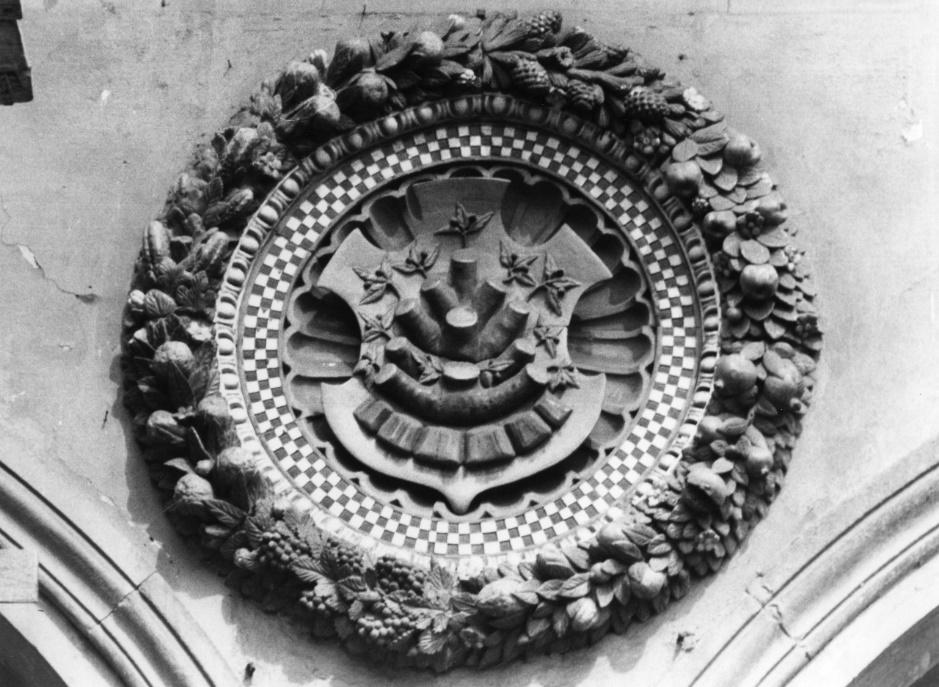

<h3 style="color:#ff0000;">Results:</h3>

The query returned some records. Interestingly, these results correspond to two of the coats of arms (*stemmi*) that we had already identified in the previous query, effectively making them duplicate entries within our dataset.

<h2 style="color:#ff0000;">Query 3 — Identifying Subjects Related to the Ospedale del Ceppo</h2>

The goal of this query was to discover **subject resources connected to the Ospedale del Ceppo** ([https://w3id.org/arco/resource/Site/4215fe83165269413c37c21663c3d94b](https://w3id.org/arco/resource/Site/4215fe83165269413c37c21663c3d94b)) and to investigate whether the [ArCo](http://wit.istc.cnr.it/arco/) knowledge graph contains specific thematic or contextual references to the site. By searching for labels that include both "Ospedale del Ceppo" and "Pistoia", the query helps uncover how the institution is described within the dataset and may reveal additional contextual information beyond the main cultural heritage record.

<h3 style="color:#ff0000;">Explanation of the keywords used:</h3>

- **cd:Subject**: specifies that the query is looking for resources of type Subject in the ArCo Context Description ontology.
- **rdfs:label**: retrieves the human-readable label associated with each subject resource.
- **SELECT DISTINCT ?subject ?label**: returns the URI of each subject and its label while removing duplicate results.
- **FILTER(REGEX(?label, "Spedale del Ceppo", "i"))**: restricts the results to subjects whose labels contain the phrase "Spedale del Ceppo". The "i" option makes the search case-insensitive.
- **FILTER(REGEX(?label, "Pistoia", "i"))**: further narrows the results to labels that also contain the term "Pistoia", ensuring that only subjects specifically related to the Spedale del Ceppo in Pistoia are returned.

<h3 style="color:#ff0000;">SPARQL Query:</h3>

```sparql
PREFIX a-cd: <https://w3id.org/arco/ontology/context-description/>
PREFIX rdfs: <http://www.w3.org/2000/01/rdf-schema#>

SELECT DISTINCT ?subject ?label
WHERE {
  ?subject a a-cd:Subject ;
           rdfs:label ?label .

  FILTER (REGEX(?label, "Ospedale del Ceppo", "i"))
  FILTER (REGEX(?label, "Pistoia", "i"))
}
```

<h3 style="color:#ff0000;">Screenshot of Results:</h3>

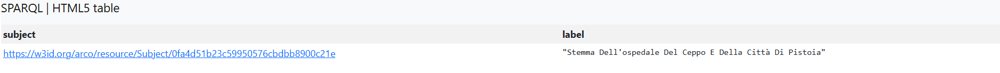

The only IRI is again related to the Stemma:

Stemma Dell'ospedale Del Ceppo E Della Città Di Pistoia ([https://w3id.org/arco/resource/Subject/0fa4d51b23c59950576cbdbb8900c21e](https://w3id.org/arco/resource/Subject/0fa4d51b23c59950576cbdbb8900c21e))

<h2 style="color:#ff0000;">Query 4 — Finding information about the frieze subject "Sette Opere di Misericordia" with a LIMIT</h2>

Up to this point, we have executed three queries, but we **only retrieved information regarding the coats of arms of the Spedale del Ceppo**. Now, we want to investigate another crucial element of the hospital: its famous [frieze](http://himetop.wikidot.com/the-seven-corporal-works-of-mercy-s-frieze). Since the frieze depicts the *Seven Works of Mercy* (Sette Opere di Misericordia), we formulated a specific query to find information about this exact subject. We included a **LIMIT 50** clause because we hypothesized that the database would contain many artworks depicting this theme.

<h3 style="color:#ff0000;">Keywords and Query Elements Description:</h3>

- **PREFIX**: Declares the vocabularies (ontologies) used in the query, creating abbreviations to make the code more readable.
- **SELECT DISTINCT**: SELECT indicates which variables to display in the final results. Adding DISTINCT is crucial: it tells the system to remove duplicates, returning each cultural property only once, even if it has multiple similar labels.
- **?cp**: An arbitrary variable (likely chosen for Cultural Property) that acts as a placeholder for the IRIs of the items the system will find.
- **a**: A highly useful SPARQL shortcut for rdf:type. It indicates that the ?cp element must belong to the class that follows it.
- **arco:HistoricOrArtisticProperty**: The specific ArCo ontology class that restricts the search exclusively to historical and artistic properties (excluding, for instance, archaeological finds, photographs, or natural heritage).
- **rdfs:label**: The standard property used to extract the name, title, or textual label assigned to that item in the database.
- **FILTER**: A command that imposes a restrictive condition on the results, discarding anything that doesn't meet the criteria.
- **REGEX(..., "i")**: A *Regular Expression*. It searches for a specific text string ("Sette Opere di Misericordia") within the ?l variable. The "i" parameter (case-insensitive) is a smart touch: it finds the text regardless of uppercase or lowercase letters.
- **LIMIT 50**: A pagination command that forces the endpoint to stop after finding and returning the first 50 valid results.

Based on our reasoning, this query pursues the following **strategic goals**:

- **Searching by subject:** Instead of searching by location (Spedale del Ceppo), we are searching for what the artwork shows. This helps us find the art even if the database is missing its location link.
- **Finding the Frieze:** Our main goal is to find the Della Robbia frieze. We are hoping the cataloguers put "Sette Opere di Misericordia" right in the title.
- **Testing with LIMIT 50:** We want to see how many results pop up. Using **LIMIT 50** is a quick way to check if this theme is very common in the database and it is more useful than reading through hundreds of results.

<h3 style="color:#ff0000;">SPARQL Query:</h3>

```sparql
PREFIX rdf: <http://www.w3.org/1999/02/22-rdf-syntax-ns#>
PREFIX arco: <https://w3id.org/arco/ontology/arco/>
PREFIX a-cd: <https://w3id.org/arco/ontology/context-description/>

SELECT DISTINCT ?cp
WHERE {
  ?cp a arco:HistoricOrArtisticProperty ;
       rdfs:label ?l .
  FILTER(REGEX(?l, "Sette Opere di Misericordia", "i"))
}
LIMIT 50
```

<h3 style="color:#ff0000;">Screenshot of Results:</h3>

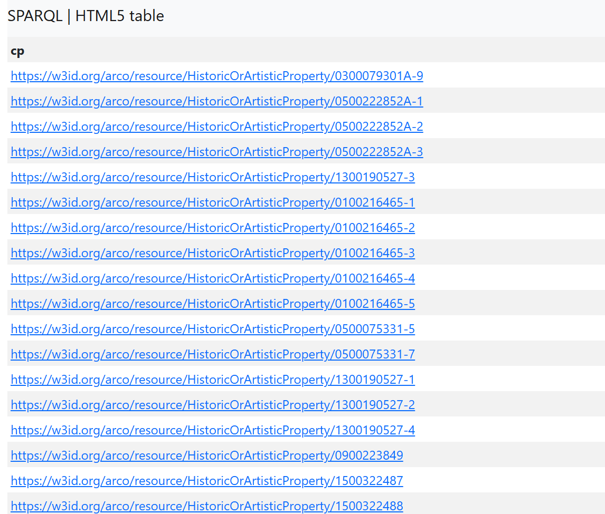

<h3 style="color:#ff0000;">Results:</h3>

From this long list we found only 1 IRI related to the **Frieze of the Ospedale del Ceppo**:

Sette opere di Misericordia (rilievo) by Buglioni Santi (sec. XVI) — [https://w3id.org/arco/resource/HistoricOrArtisticProperty/0900040485A-0](https://w3id.org/arco/resource/HistoricOrArtisticProperty/0900040485A-0)

We also found a quite rich description of it:


<h2 style="color:#ff0000;">Query 5 — Identifying Cultural Properties Related to the Frieze of the Spedale del Ceppo</h2>

By analyzing the IRI retrieved in our previous research, Sette opere di Misericordia (rilievo) by Buglioni Santi (sec. XVI) ([https://w3id.org/arco/resource/HistoricOrArtisticProperty/0900040485A-0](https://w3id.org/arco/resource/HistoricOrArtisticProperty/0900040485A-0)), we made an important discovery: **the elements of the frieze can be classified under different categories in the ArCo database.** Some are catalogued as standard historical properties (HistoricOrArtisticProperty), while others might be treated as movable objects (MovableCulturalProperty), perhaps because they are individual terracotta panels.

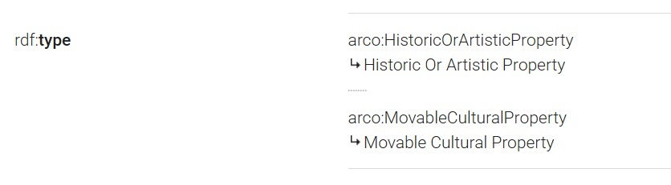

To ensure we didn't miss any crucial information due to these different cataloguing choices, **we needed to investigate both categories simultaneously.** Furthermore, we refined our search text to specifically target items that mention both 'Fregio' (Frieze) and 'Ospedale del Ceppo'. To do this, we used the **UNION** operator to combine two different searches into one.

<h3 style="color:#ff0000;">Explanation of keywords used:</h3>

- **arco:HistoricOrArtisticProperty:** specifies that the query searches for resources classified as historic or artistic cultural properties.
- **arco:MovableCulturalProperty:** specifies that the query also searches for resources classified as movable cultural properties.
- **rdfs:label:** retrieves the human-readable label associated with each cultural property.
- **SELECT DISTINCT ?cp:** returns the unique cultural property resources found by the query, removing duplicate results.
- **FILTER(REGEX(?l, "Fregio", "i")):** restricts the results to resources whose labels contain the word "Fregio". The "i" flag makes the search case-insensitive.
- **FILTER(REGEX(?l, "Spedale del Ceppo", "i")):** narrows the first part of the query to resources explicitly referring to the Spedale del Ceppo.
- **FILTER(REGEX(?l, "Ospedale del Ceppo", "i")):** narrows the second part of the query to resources using the alternative form "Ospedale del Ceppo", ensuring that different naming conventions are captured.
- **UNION**: combines the results from the two searches, allowing the query to retrieve matching resources from both cultural property classes.

<h3 style="color:#ff0000;">SPARQL Query:</h3>

```sparql
PREFIX rdf: <http://www.w3.org/1999/02/22-rdf-syntax-ns#>
PREFIX arco: <https://w3id.org/arco/ontology/arco/>
PREFIX a-cd: <https://w3id.org/arco/ontology/context-description/>

SELECT DISTINCT ?cp
WHERE {
    {
        ?cp a arco:HistoricOrArtisticProperty ;
            rdfs:label ?l .
        FILTER(REGEX(?l, "Fregio", "i"))
        FILTER(REGEX(?l, "Ospedale del Ceppo", "i"))
    }
UNION
   {
        ?cp a arco:MovableCulturalProperty ;
            rdfs:label ?l .
        FILTER(REGEX(?l, "Fregio", "i"))
        FILTER(REGEX(?l, "Ospedale del Ceppo", "i"))
    }
}
```

<h3 style="color:#ff0000;">Screenshot of Results:</h3>

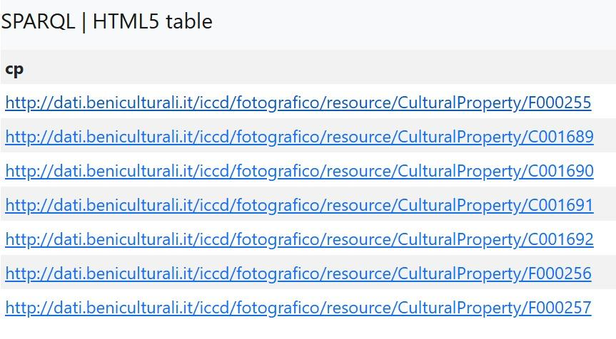

<h3 style="color:#ff0000;">Results:</h3>

The query successfully returned several IRIs. If we look closely at the structure of these web addresses, we can see they belong to the *fotografico* (photographic) section of the ICCD (Central Institute for Cataloging and Documentation).

- Pistoia - Ospedale del Ceppo, loggia con fregio (negativo) (sec. XX inizio) — [http://dati.beniculturali.it/iccd/fotografico/resource/CulturalProperty/F000255](http://dati.beniculturali.it/iccd/fotografico/resource/CulturalProperty/F000255)

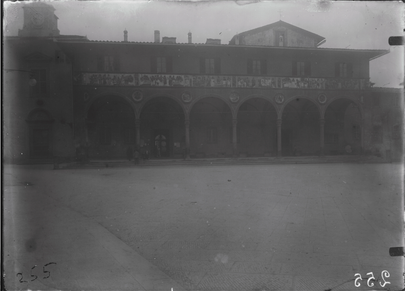

- Pistoia - Ospedale del Ceppo, fregio con le Opere di misericordia (negativo) (sec. XX inizio) — [http://dati.beniculturali.it/iccd/fotografico/resource/CulturalProperty/C001689](http://dati.beniculturali.it/iccd/fotografico/resource/CulturalProperty/C001689)

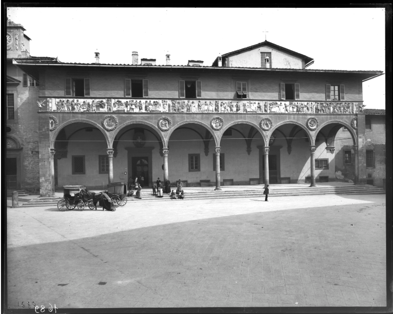

- Pistoia - Ospedale del Ceppo, fregio con le Opere di misericordia, particolare (negativo) (sec. XX inizio) — [http://dati.beniculturali.it/iccd/fotografico/resource/CulturalProperty/C001690](http://dati.beniculturali.it/iccd/fotografico/resource/CulturalProperty/C001690)

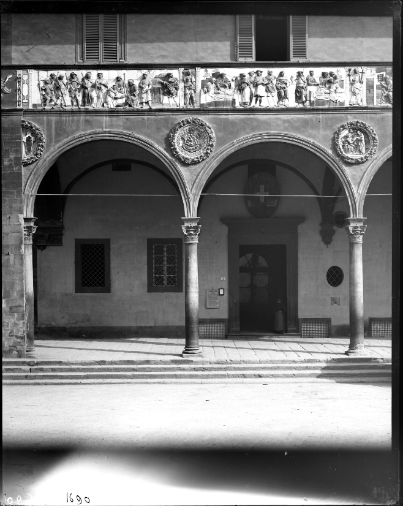

- Pistoia - Ospedale del Ceppo, fregio con le Opere di misericordia, particolare (negativo) (sec. XX inizio) — [http://dati.beniculturali.it/iccd/fotografico/resource/CulturalProperty/C001691](http://dati.beniculturali.it/iccd/fotografico/resource/CulturalProperty/C001691)

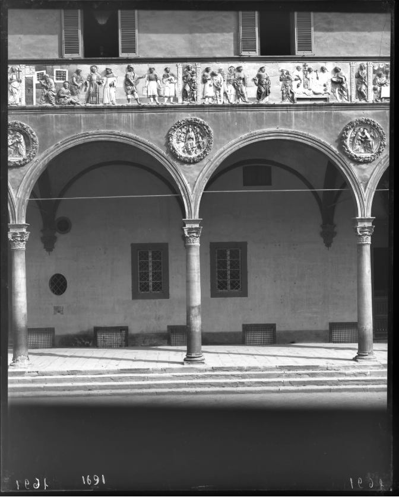

- Pistoia - Ospedale del Ceppo, fregio con le Opere di misericordia, particolare (negativo) (sec. XX inizio) — [http://dati.beniculturali.it/iccd/fotografico/resource/CulturalProperty/C001692](http://dati.beniculturali.it/iccd/fotografico/resource/CulturalProperty/C001692)

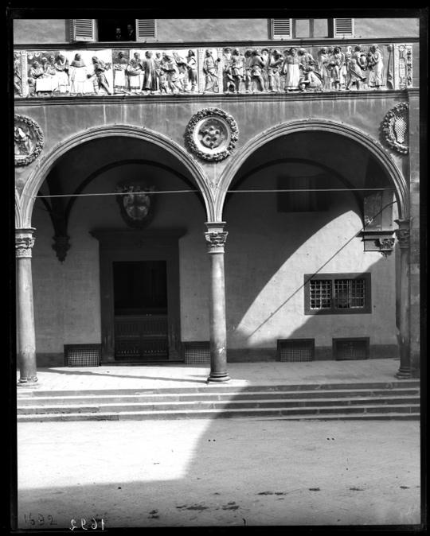

- Pistoia - Ospedale del Ceppo, loggia con fregio (negativo) (sec. XX inizio) — [http://dati.beniculturali.it/iccd/fotografico/resource/CulturalProperty/F000256](http://dati.beniculturali.it/iccd/fotografico/resource/CulturalProperty/F000256)

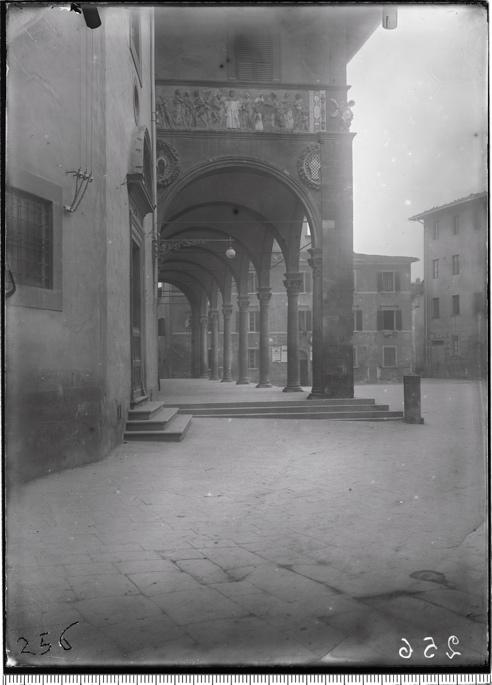

- Pistoia - Ospedale del Ceppo, loggia con fregio (negativo) (sec. XX inizio) — [http://dati.beniculturali.it/iccd/fotografico/resource/CulturalProperty/F000257](http://dati.beniculturali.it/iccd/fotografico/resource/CulturalProperty/F000257)

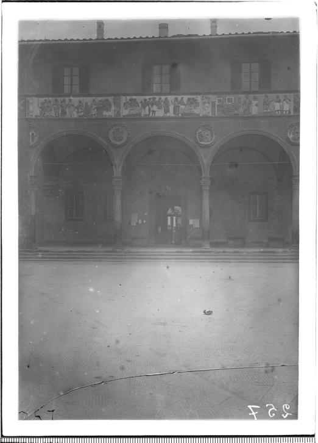

The results obtained from the **UNION** query are highly revealing. Instead of just physical objects, the query retrieved a series of **photographic resources** (F-series and C-series IRIs) depicting the hospital, the main loggia, and specifically the Della Robbia frieze. Because these photographic records are accompanied by rich, detailed textual descriptions in the database, we can confidently conclude that the frieze is excellently documented within ArCo. Despite initial difficulties in finding the physical location links, the photographic catalogue provides more than enough solid references and historical data about the frieze to support our research.

<h2 style="color:#ff0000;">Query 6 — Ordering Results Related to the Ospedale del Ceppo by date</h2>

This query was designed to **retrieve cultural heritage resources related to the Ospedale del Ceppo** ([https://w3id.org/arco/resource/Site/4215fe83165269413c37c21663c3d94b](https://w3id.org/arco/resource/Site/4215fe83165269413c37c21663c3d94b)) and display them together **with their associated dates**. By **ordering the results by date in descending order**, we aimed to identify the most recent records and to obtain a chronological overview of the resources connected to the site.

<h3 style="color:#ff0000;">Explanation of keywords used:</h3>

- **arco:HistoricOrArtisticProperty**: specifies that the query is looking for resources classified as historic or artistic cultural properties.
- **rdfs:label**: retrieves the label or name associated with each cultural property.
- **dc:date:** retrieves the date associated with the resource.
- **SELECT DISTINCT ?cp ?date**: returns each cultural property together with its date, removing duplicate results.
- **FILTER(REGEX(?l, "Spedale", "i"))**: restricts the results to resources whose labels contain the word "Spedale".
- **FILTER(REGEX(?l, "del Ceppo", "i")):** further narrows the search to resources specifically related to the Spedale del Ceppo.
- **ORDER BY DESC(?date)**: sorts the results in descending order according to the date, showing the most recent entries first.

<h3 style="color:#ff0000;">SPARQL Query:</h3>

```sparql
PREFIX rdf: <http://www.w3.org/1999/02/22-rdf-syntax-ns#>
PREFIX arco: <https://w3id.org/arco/ontology/arco/>
PREFIX a-cd: <https://w3id.org/arco/ontology/context-description/>
PREFIX cis: <http://dati.beniculturali.it/cis/>

SELECT DISTINCT ?cp ?date
WHERE {
  ?cp a arco:HistoricOrArtisticProperty ;
     rdfs:label ?l ;
     dc:date ?date .
  FILTER(REGEX(?l, "Spedale", "i"))
  FILTER(REGEX(?l, "del Ceppo", "i"))
}
ORDER BY DESC (?date)
```

<h3 style="color:#ff0000;">Screenshot of Results:</h3>

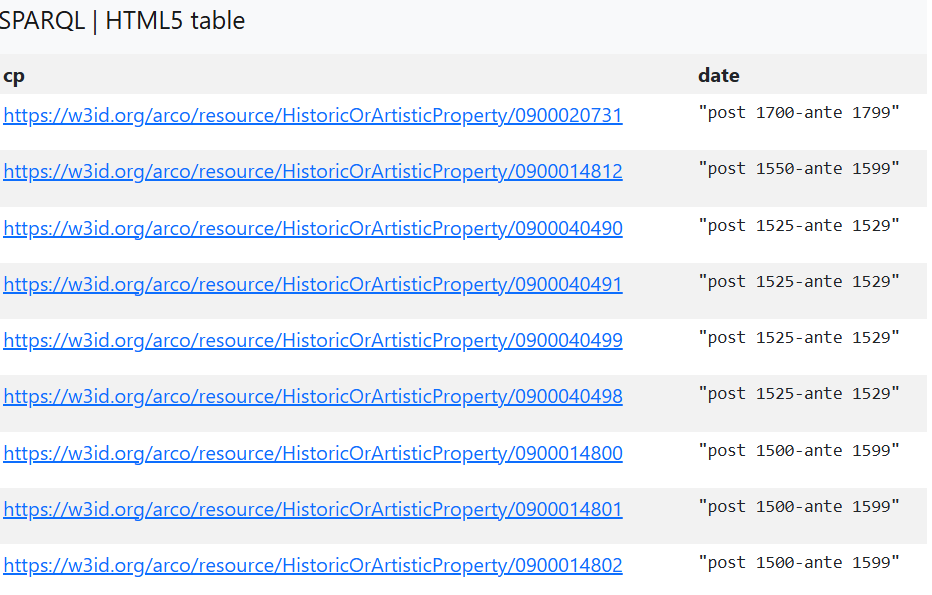

<h3 style="color:#ff0000;">Results:</h3>

Interestingly, the results obtained are the same as those found in **Query 1**, but this time, they are ordered by date, ranging from the early sixteenth century to the eighteenth century, highlighting the temporal richness of the heritage assets associated with the Ospedale del Ceppo. As a result, the query provides insight not only into the variety of cultural properties linked to the Ospedale del Ceppo but also into the historical periods that are most strongly represented within the knowledge graph.

<h2 style="color:#ff0000;">General conclusions:</h2>

Based on the series of SPARQL queries conducted on the [ArCo Knowledge Graph](http://wit.istc.cnr.it/arco/), we can draw several **key conclusions** regarding the digital representation of the Ospedale del Ceppo and its artworks:

- We successfully confirmed that the **Ospedale del Ceppo** exists as a **distinct entity within the ontology**. However, we observed a significant **lack of descriptive properties** (predicates) **directly associated with the hospital itself**, which presents a clear opportunity for future research and data enrichment within the Knowledge Graph.
- Our **queries revealed** that the **Fregio Robbiano** (the Robbiano Frieze) is extremely **well-documented**. We were able to retrieve a substantial amount of information, demonstrating that this specific masterpiece has been thoroughly catalogued with rich metadata. Having found abundant information about the frieze, **a logical next step for future investigation would be to shift our focus to the coats of arms** (*stemmi*). It would be highly relevant to analyze whether these specific artifacts are adequately described within the dataset, specifically, checking if they are linked to a rich set of informative predicates or if they suffer from missing information, much like the hospital entity itself.
