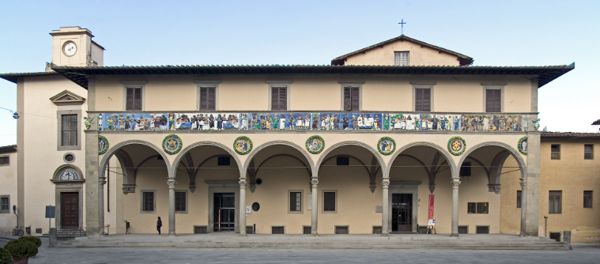
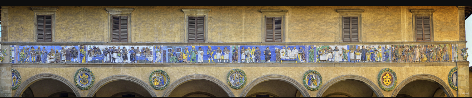
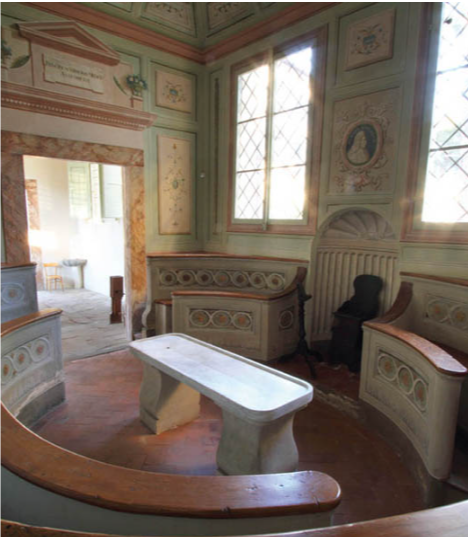
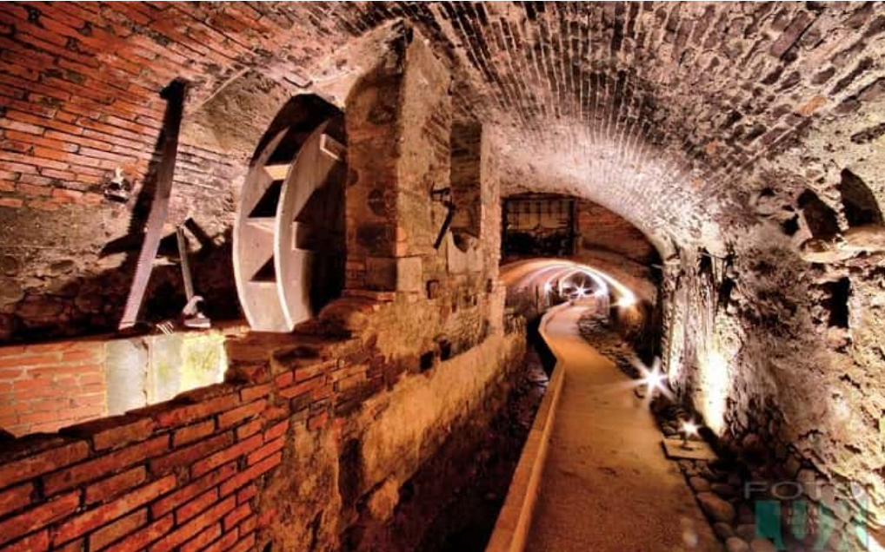

### Sections:

- [🏠 Home](index.html)
- [🏛️ Topic](topic.html)
- [⚒️ Semantic Methodology](methodology.html)
- [📈 SPARQL Queries & Data Results](sparql.html)
- [🧩 Gap Identification](gaps.html)
- [🤖 LLM Prompt: ChatGPT & Gemini](prompts.html)
- [🔗 RDF Triple Generation](rdf.html)
- [⚠️ Key Challenges](challenges.html)
- [🎯 Conclusions & Insights](conclusions.html)

<h1 style="color:#ff0000;">🏛️ Topic </h1>

<h2 style="color:#ff0000;">Overview of the structure</h2>

<h2 style="color:#ff0000;">Frieze and medallions</h2>

<h2 style="color:#ff0000;">Teatrino Anatomico</h2>

<h2 style="color:#ff0000;">Pistoia Sotterranea</h2>

Founded in **1277**, the **Spedale del Ceppo in Pistoia** stands as a monumental testament to both medical history and Renaissance art. Having functioned continuously as the city's primary healthcare institution for over seven centuries, most notably during the [Black Death](https://en.wikipedia.org/wiki/Black_Death) of 1348, the complex expanded organically over time. Its vast architectural structure is unified by a **magnificent 16th-century loggia**, inspired by Brunelleschi's Florentine models. The loggia's façade is crowned by a spectacular polychrome glazed **terracotta frieze** crafted by [Santi Buglioni](https://en.wikipedia.org/wiki/Santi_Buglioni), vividly **illustrating the Seven Works of Mercy** interspersed with the Virtues, and is beautifully complemented by exquisite medallions (**tondi**) by [Giovanni della Robbia](https://en.wikipedia.org/wiki/Giovanni_della_Robbia).

Beyond its artistic exterior, the Spedale was a prominent center for scientific advancement, home to a prestigious [**Medical Academy**](https://www.accademiafilippopacini.it/). Inside, it preserves a rare 18th-century Anatomical Theatre ([**Teatrino Anatomico**](https://blogcamminarenellastoria.wordpress.com/2021/04/27/il-teatro-anatomico-della-scuola-medica-di-pistoia/)), a small, elegantly frescoed amphitheater historically used for dissections and medical instruction. Today, the complex operates as a museum and serves as the gateway to **Pistoia Sotterranea**, a fascinating underground archaeological pathway that winds beneath the hospital through ancient, vaulted riverbeds, revealing centuries of layered urban and architectural history.

We thought that the **Spedale del Ceppo matches perfectly with this project** because:

- This iconic **Tuscan** site holds immense historical value and is closely tied to the local heritage and cultural identity of Pistoia.
- **The site blends art, medicine, and archaeology,** providing a rich basis for creating semantic connections with similarly complex historical monuments.
- Even though current records are factually sound, **we can greatly enrich its structural representation by adding missing details and broader semantic relations.**
- The Spedale is situated in the hometown of one of our team members, Chiara, while Alice visited it during a school trip in elementary school.

<h2 style="color:#ff0000;">PROJECT GOALS</h2>

- To query the [**ArCo**](http://wit.istc.cnr.it/arco/)  ontology network via its dedicated [SPARQL endpoint](https://dati.cultura.gov.it/sparql), aiming to **retrieve pertinent and structured data concerning the subject of our project**: Spedale del Ceppo.
- To employ advanced **Large Language Models** (e.g., [ChatGPT](https://chatgpt.com/) and [Gemini]( https://gemini.google.com/app ) 
) to **generate novel insights and formulate new RDF triples**, that could enrich the ArCo Knowledge Graph.
